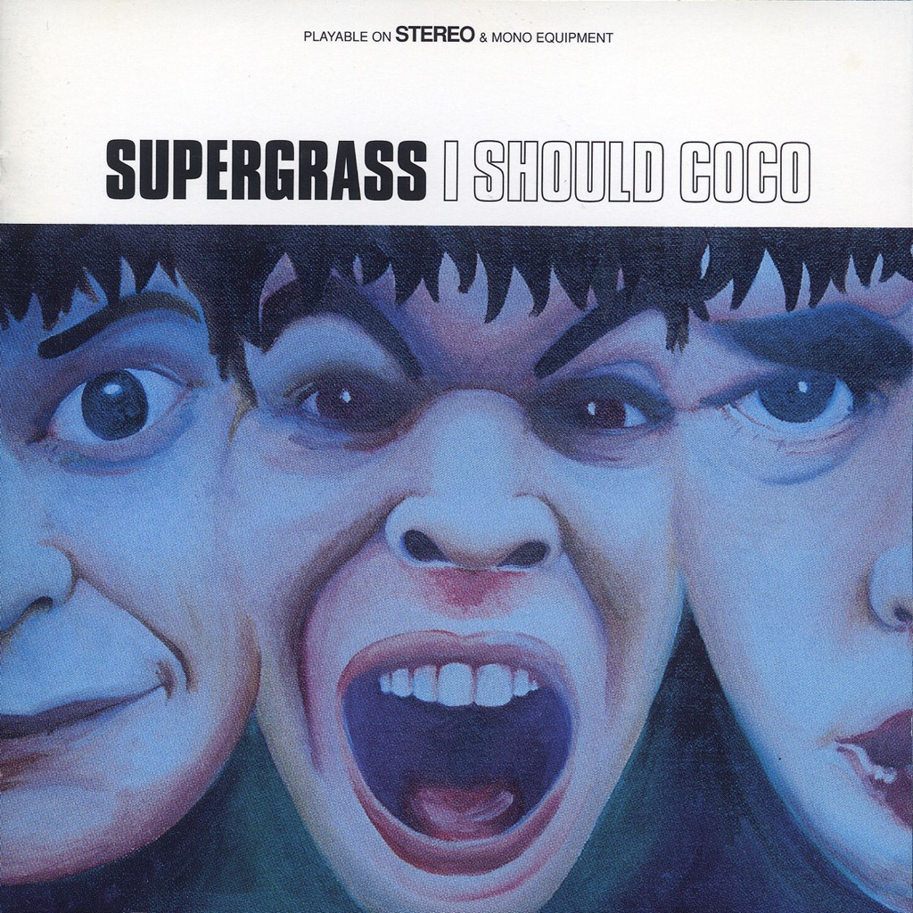

<!-- section break -->

1. I'd Like To Know (4:02)
2. Caught By The Fuzz (2:16)
3. Mansize Rooster (2:34)
4. Alright (2:01)
5. Lose It (2:37)
6. Lenny (2:41)
7. Strange Ones (4:19)
8. Sitting Up Straight (2:18)
9. She's So Loose (2:59)
10. We're Not Supposed To (2:03)
11. Time (3:10)
12. Sofa (Of My Lethargy) (6:18)
13. Time To Go (1:56)
14. Stone Free (3:10)
15. Odd (5:05)

<!-- section break -->

## Spotify


## Videos
### Supergrass - Caught By The Fuzz (Official HD Video - US Version)
 

### More Videos

- [Supergrass - Alright (Official HD Video)](https://www.youtube.com/watch?v=qUE4oDunYkc)
- [Supergrass - Mansize Rooster (Official HD Video)](https://www.youtube.com/watch?v=dHlLcVHncDw)

## Release Information
|  Key           | Value                                                |
| ---------------| ---------------------------------------------------- |
| Release Year   | 2015                                   |
| Discogs Link   | [Supergrass - I Should Coco](https://www.discogs.com/release/7490505-Supergrass-I-Should-Coco) |
| Label          | Parlophone |
| Format         | Vinyl LP Album Reissue Remastered, Vinyl 7" 45 RPM Single, All Media Limited Edition |
| Catalog Number | 0825646130573 |
| Notes | 20th anniversary edition. Album is dedicated to David Norland 1974-2014. Supergrass and I Should Coco are embossed.  Recorded at Sawmills Studio, Golant, Fowey, Cornwall. Musical thanks to James Halliwell, The Jazz Monk, Matt Burley and Sam Williams.  B side label of 7" is plain red. Embossed letters on front sleeve. Comes with a [l873810] download code. |