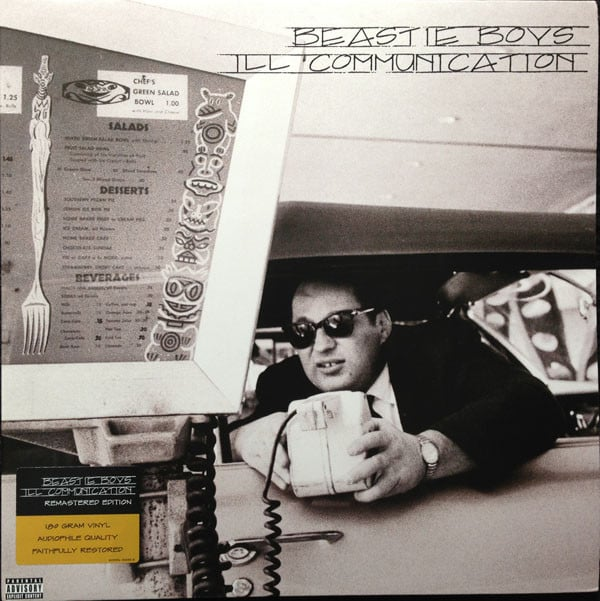

<!-- section break -->

1. Sure Shot (3:20)
2. Tough Guy (0:58)
3. B-Boys Makin' With The Freak Freak (3:54)
4. Bobo On The Corner (1:13)
5. Root Down (3:32)
6. Sabotage (2:59)
7. Get It Together (4:06)
8. Sabrosa (3:30)
9. The Update (3:16)
10. Futterman's Rule (3:42)
11. Alright Hear This (3:07)
12. Eugene's Lament (2:13)
13. Flute Loop (1:55)
14. Do It (3:17)
15. Ricky's Theme (3:44)
16. Heart Attack Man (2:15)
17. The Scoop (3:36)
18. Shambala (3:41)
19. Bodhisattva Vow (3:09)
20. Transitions (3:32)

<!-- section break -->

## Spotify


## Videos
### Tough Guy (Remastered 2009)
 

### More Videos

- [Beastie Boys - Sabotage](https://www.youtube.com/watch?v=z5rRZdiu1UE)
- [Beastie Boys - Sure Shot](https://www.youtube.com/watch?v=JhqyZeUlE8U)
- [Beastie Boys - Root Down](https://www.youtube.com/watch?v=Xf1YF_MH1xc)
- [Beast̲i̲e̲ ̲B̲o̲ys - Ill Communication (Full Album)](https://www.youtube.com/watch?v=ajbr64jeLjQ)
- [Tough Guy - Beastie Boys](https://www.youtube.com/watch?v=DNkYVaRzhxE)
- [Tough Guy](https://www.youtube.com/watch?v=30CKfFLfNh0)

## Release Information
|  Key           | Value                                                |
| ---------------| ---------------------------------------------------- |
| Release Year   | 2009                                   |
| Discogs Link   | [Beastie Boys - Ill Communication](https://www.discogs.com/release/1856276-Beastie-Boys-Ill-Communication) |
| Label          | Capitol Records |
| Format         | Vinyl 2× LP Album Remastered Reissue (180 gram, Gatefold) |
| Catalog Number | 509996 94232 15 |
| Notes | Gatefold sleeve.  ℗ © 1994 Capitol Records, LLC and Beastie Boys  All songs published by Brooklyn Dust Music/Polygram International Publishing, Inc. (ASCAP) except "Get It Together" published by Brooklyn Dust Music/Polygram International Publishing, Inc. (ASCAP) and Zomba Enterprises, Inc./Jazz Merchant Music (ASCAP).  Recorded & mixed at G-Son Studios, with the parquet floor, Atwater Village, CA and Tin Pan Alley, New York, NY. Sequenced at Bundy's Playhouse. Mastered at Futuredisc  Q-Tip appears courtesy of Jive Records Biz Markee appears courtesy of His Own Damn Self  A1: Contains a sample from "The Funny Side Of Moms Mabley" Recording courtesy of MCA Records, Inc., and embodies portions of of the composition "Howlin' For Judy published by EMI Deshon Music, Inc. (BMI), performed by Jeremy Steig, courtesy of Blue Note Records, a division of Capitol Records, Inc. A5 contains samples from "Root Down (And Get It)" published by Jimmy's Music and performed by Jimmy Smith under license from Polygram Special Markets, a division of Polygram Group Distribution, Inc. B2 contains samples from "Headless Heroes published by Lonport Music (BMI) performed by Eugene McDaniels, courtesy of Atlantic Recording Corporation, by arrangement with Warner Special Products. B4 contains a sample from "Children of the Earth Flames" performed by John Klemmer, courtesy of MCA Records, Inc. C1 contains excerpts from "Graffiti Rock" performed by Michael Holman, courtesy of Michael Holman. C3: contains elements from "Flute Thing" published by Unichappell Music, Inc./Sea-Lark Entertainment and Six Continents Music (BMI). All rights administered by Unichappell Music, Inc. "Flute "Thing" performed by The Blues Project, under license from Polygram Special Markets, a division of Polygram Group Distribution, Inc.; and contains a sample from "Craps (After Hours)" performed by Richard Pryor, courtesy of Richard Pryor. D2 contains a sample from"Jacob's Ladder" published by Vernita Music (BMI) and performed by Cedar Walton, Jr., courtesy of Columbia Records; and contains samples from "Atma-Tomorrow" performed by Michael Urbaniak's Fusion, courtesy of Columbia Records; and contains samples from "I Know I Could Love You Better" performed by The Free Movement, courtesy of Columbia Records; and contains samples from "Tough" published by Neutral Gray Music, Original J.B. Music, Funkgroove Music & Rushgroove Music (ASCAP) and performed by Kurtis Blow, under license from Polygram Special Markets, a division of Polygram Group Distribution, Inc.  The original matrix number, 28599, is still in the runouts but crossed out with a sequence of Xs.  Track durations not listed on release. |