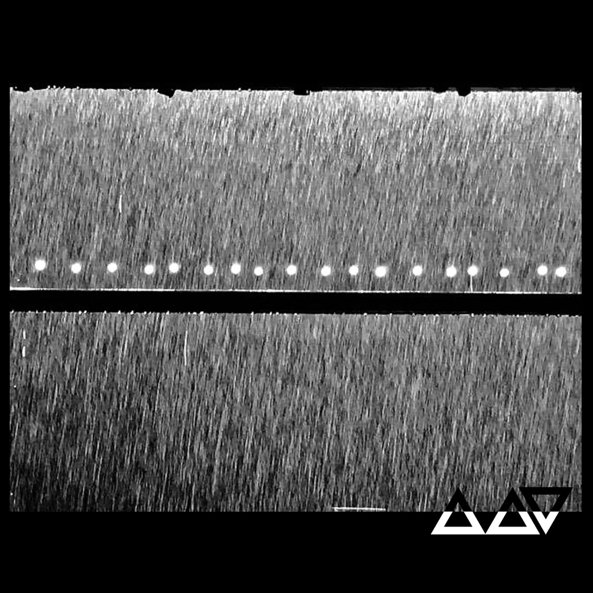

<!-- section break -->

1. Silhouette
2. Super Sleuth
3. Elemental
4. Lancelot
5. In The Dead, Dead Wood
6. Weight In Gold
7. Mourning On The Range
8. Forc In The Road

<!-- section break -->

## Videos
### VENNART - SUPER SLEUTH (TAROT LYRIC VIDEO)
 

## Release Information
|  Key           | Value                                                |
| ---------------| ---------------------------------------------------- |
| Release Year   | 2021                                   |
| Discogs Link   | [Vennart - In The Dead, Dead Wood](https://www.discogs.com/release/18001318-Vennart-In-The-Dead-Dead-Wood) |
| Label          | Not On Label (Vennart Self-released) |
| Format         | Vinyl LP Album Limited Edition (Clear w/ Black Blob [Silhouette]) |
| Catalog Number | none |
| Notes | Limited to 300 copies. The sleeve features spot varnish artwork and the release comes with 8 Tarot cards. The cards have lyrics and credits on them and come in a white envelope that has a hand written excerpt from the lyrics on the front. No credits appear on the sleeve. |