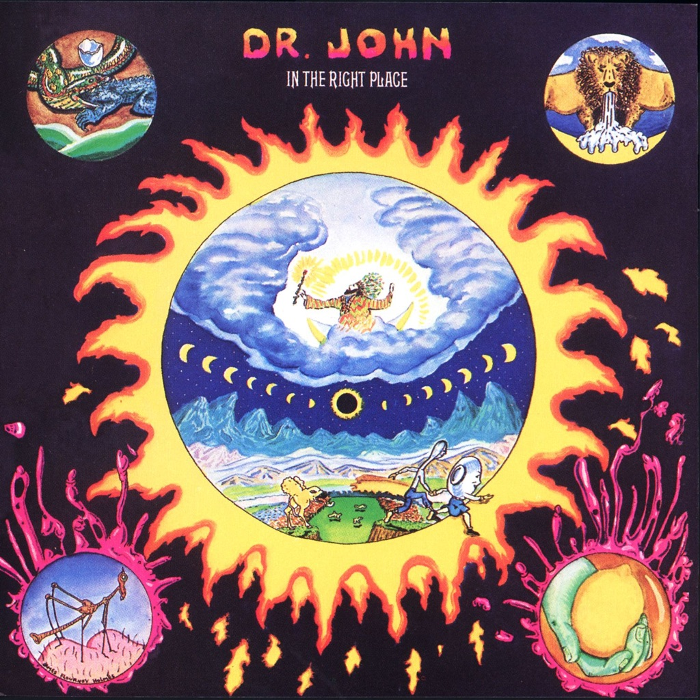

<!-- section break -->

1. Right Place Wrong Time (2:50)
2. Same Old Same Old (2:39)
3. Just The Same (2:49)
4. Qualified (4:46)
5. Traveling Mood (3:03)
6. Peace Brother Peace (2:47)
7. Life (2:29)
8. Such A Night (2:55)
9. Shoo Fly Marches On (3:15)
10. I Been Hoodood (3:12)
11. Cold Cold Cold (2:37)

<!-- section break -->

## Spotify


## Videos
### Qualified
 

### More Videos

- [Right Place Wrong Time](https://www.youtube.com/watch?v=zw-2CTx4YgY)
- [Same Old Same Old](https://www.youtube.com/watch?v=R9FXjsc9uBs)
- [Just the Same](https://www.youtube.com/watch?v=aSfIvbQ39ZY)
- [Traveling Mood](https://www.youtube.com/watch?v=ZBm_EW2qqAk)
- [Peace Brother Peace](https://www.youtube.com/watch?v=fPcIqqUhVtk)
- [Life](https://www.youtube.com/watch?v=03eYl97ZbUg)
- [Such a Night](https://www.youtube.com/watch?v=fj9lG30WzcA)
- [Shoo Fly Marches On](https://www.youtube.com/watch?v=xARxgZKQ0IE)
- [I Been Hoodood](https://www.youtube.com/watch?v=8abnes8TpW8)
- [Cold Cold Cold (Single)](https://www.youtube.com/watch?v=lO8RbsTX8Sg)

## Release Information
|  Key           | Value                                                |
| ---------------| ---------------------------------------------------- |
| Release Year   | 2015                                   |
| Discogs Link   | [Dr. John - In The Right Place](https://www.discogs.com/release/6772705-Dr-John-In-The-Right-Place) |
| Label          | ATCO Records |
| Format         | Vinyl LP Album Reissue (180g) |
| Catalog Number | 0349791111 |
| Notes | Reissue on 180g vinyl with tri-fold cover (3 pages to view), with disc inserted into external pocket opening in left-hand spine,  like the original 1973 cover. |