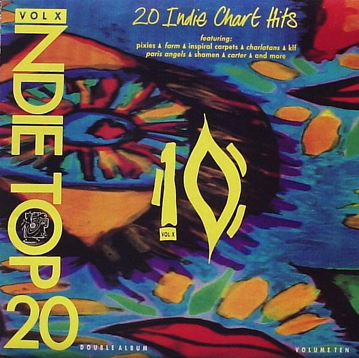

<!-- section break -->

1. Groovy Train (Terry Farley Mix)
2. Make It Mine
3. All On You (Perfume)
4. What Time Is Love? (Echo & The Bunnymen Mix)
5. Biting My Nails (Bassnumb Chapter)
6. It's On
7. Triangle (Edit)
8. Only Love Can Break Your Heart
9. Lay Me Down
10. Scratches (In The Sand)
11. She Comes In The Fall
12. The Only One I Know
13. Waiting For The Angels
14. Anyway That You Want Me
15. Place With A Name
16. Velouria
17. Grand Hotel
18. Everything Flows
19. Precious Little
20. Rent

<!-- section break -->

## Videos
### Only Love Can Break Your Heart - Saint Etienne
 

### More Videos

- [THE FARM - GROOVY TRAIN (TERRY FARLEY REMIX) (1990)](https://www.youtube.com/watch?v=fOj_zwVKY-w)
- [The Shamen - Make It Mine](https://www.youtube.com/watch?v=HyPpiHQupeQ)
- [Paris Angels - All on you (perfume)](https://www.youtube.com/watch?v=SN6dTK_OrmE)
- [The KLF - What Time Is Love? (Echo & The Bunnymen Mix)](https://www.youtube.com/watch?v=MlLJ-9JibAQ)
- [Renegade Soundwave - Biting My Nails (Bassnumb Chapter)](https://www.youtube.com/watch?v=z7_yhgJ3opc)
- [Flowered Up - It's On](https://www.youtube.com/watch?v=fGPTVRGqfeo)
- [The Field Mice - Triangle (Full Version)](https://www.youtube.com/watch?v=Ql76Q0nSiyY)
- [Mock Turtles - Lay Me Down](https://www.youtube.com/watch?v=odVnozap64M)
- [Spin Scratches in the Sand](https://www.youtube.com/watch?v=tX0V_Dfz9Aw)
- [Inspiral Carpets - She comes in the fall](https://www.youtube.com/watch?v=_GnHkfGgEQM)
- [The Charlatans - The Only One I Know](https://www.youtube.com/watch?v=0RJwW77Lsj8)
- [Waiting For The Angels - The Darkside](https://www.youtube.com/watch?v=tCA6lHY523c)
- [Spiritualized Anyway That You Want Me](https://www.youtube.com/watch?v=YleJPoKBqrw)
- [The Family Cat - A Place With A Name](https://www.youtube.com/watch?v=i7Irdy0NrPM)
- [Pixies - Velouria (Official Video)](https://www.youtube.com/watch?v=nc0Mv4Iyxvc)
- [Grand Hotel, Jesse Garon and the Desperadoes](https://www.youtube.com/watch?v=M8bdbIiWAQE)
- [Teenage Fanclub - Everything Flows](https://www.youtube.com/watch?v=ctYYFETItUc)
- [THE TELESCOPES   Precious little](https://www.youtube.com/watch?v=8iHM5E1TT0A)
- [Rent - Carter USM (Pet Shop Boys Cover)](https://www.youtube.com/watch?v=1omqMqpyj4Y)

## Release Information
|  Key           | Value                                                |
| ---------------| ---------------------------------------------------- |
| Release Year   | 1990                                   |
| Discogs Link   | [Various - Indie Top 20 Vol X](https://www.discogs.com/release/449135-Various-Indie-Top-20-Vol-X) |
| Label          | Beechwood Music |
| Format         | Vinyl 2× LP Compilation |
| Catalog Number | TT010 |
| Notes | Comes in a gatefold sleeve. |