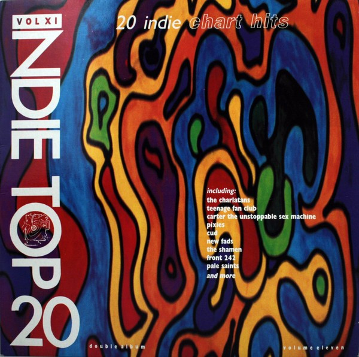

<!-- section break -->

1. Anytime Anyplace Anywhere (4:10)
2. Pray (3:56)
3. Spirit (3:25)
4. Fishes Eyes (6:45)
5. Phobia (4:42)
6. Listen (3:30)
7. Magic (3:57)
8. Moody 'Live' (4:22)
9. I Wanna Talk Like Iggy Pop (4:52)
10. Get Higher (4:30)
11. Then (4:12)
12. God Knows It's True (4:55)
13. Half Life, Remembered (4:38)
14. Cry-Blood (Dub) (6:16)
15. Oxygen Reprise V2.0 (5:20)
16. Tragedy >For You< (4:31)
17. Kaleidoscope (5:38)
18. Decadence (4:19)
19. Birdbrain (3:12)
20. Dig For Fire (2:47)

<!-- section break -->

## Videos
### The Shamen - Oxygen Restriction (Indie Top 20 Volume XI) 1991
 

### More Videos

- [The Shamen - Oxygen Restriction](https://www.youtube.com/watch?v=JxUuFgsFaMc)

## Release Information
|  Key           | Value                                                |
| ---------------| ---------------------------------------------------- |
| Release Year   | 1991                                   |
| Discogs Link   | [Various - Indie Top 20 Volume XI](https://www.discogs.com/release/589039-Various-Indie-Top-20-Volume-XI) |
| Label          | Beechwood Music |
| Format         | Vinyl 2× LP Compilation |
| Catalog Number | TT011 |
| Notes | C5 is listed as "Oxygen Restriction" but it is actually "Oxygen Reprise V2.0". |