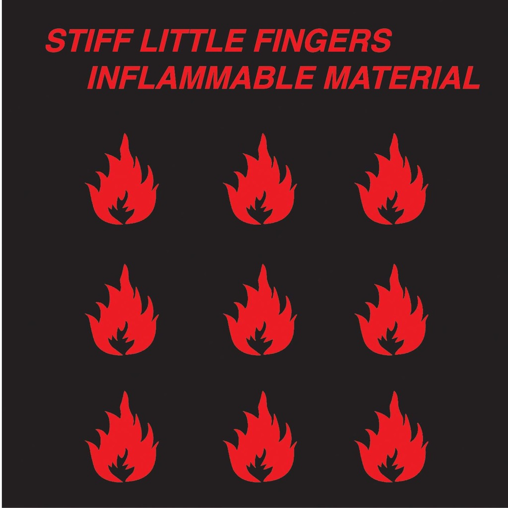

<!-- section break -->

1. Suspect Device
2. State Of Emergency
3. Here We Are Nowhere
4. Wasted Life
5. No More Of That
6. Barbed Wire Love
7. White Noise
8. Breakout
9. Law And Order
10. Rough Trade
11. Johnny Was
12. Alternative Ulster
13. Closed Groove

<!-- section break -->

## Spotify


## Videos
### Rough Trade
 

### More Videos

- [Suspect Device](https://www.youtube.com/watch?v=on6DxBgfsDY)
- [State Of Emergency](https://www.youtube.com/watch?v=-RMKSlByyMg)
- [Here We Are Nowhere](https://www.youtube.com/watch?v=mnw8LfFttp8)
- [Wasted Life](https://www.youtube.com/watch?v=8nx8adlkvFw)
- [No More of That](https://www.youtube.com/watch?v=9tAmudEXHis)
- [Barbed Wire Love](https://www.youtube.com/watch?v=anNJU1ExuJw)
- [White Noise](https://www.youtube.com/watch?v=xrocrwBVyAs)
- [Breakout](https://www.youtube.com/watch?v=HRC9C_2gHZo)
- [Law and Order](https://www.youtube.com/watch?v=LD8Y0F9BZ8A)
- [Johnny Was](https://www.youtube.com/watch?v=2SCAFiP049o)
- [Alternative Ulster](https://www.youtube.com/watch?v=PlGmYetiCjA)
- [Closed Groove](https://www.youtube.com/watch?v=xFgRXssRmQ4)

## Release Information
|  Key           | Value                                                |
| ---------------| ---------------------------------------------------- |
| Release Year   | 2019                                   |
| Discogs Link   | [Stiff Little Fingers - Inflammable Material](https://www.discogs.com/release/14224076-Stiff-Little-Fingers-Inflammable-Material) |
| Label          | Parlophone |
| Format         | Vinyl LP Album Reissue Stereo |
| Catalog Number | 0190295448271 |
| Notes | ℗ 1979 Sedgenote Ltd under exclusive license to Parlophone Records Ltd © 2019 Parlophone Records Ltd, A Warner Music Group Company. Made In The E.U.  First published in the U.K. by Rough Trade Records, 1979 in association with Rigid Digits  Includes printed innersleeve containing lyrics, info and credits.  Writing credits in tracklisting field are taken from innersleeve, and writing credits in credits field are taken from labels.  Track B3: -Bob Marley Music admin by Rondor Music (London) Ltd [Innersleeve]. -Bob Marley Music Ltd Admin by Rondor Music (London) Ltd [Labels].  Side B ends in locked groove.  Some copies have either stickers on the shrinkwrap or white blocks on the rear outer sleeve stating both "Made in Germany" and "Made in Czech Republic". Both label sides read "Made In the E.U. ...". |