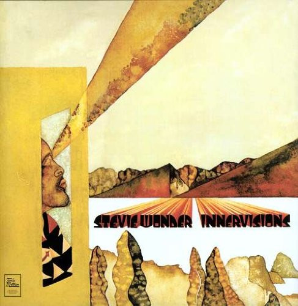

<!-- section break -->

1. Too High (4:37)
2. Visions (5:17)
3. Living For The City (7:26)
4. Golden Lady (5:00)
5. Higher Ground (3:54)
6. Jesus Children Of America (4:04)
7. All In Love Is Fair (3:45)
8. Don't You Worry 'Bout A Thing (4:55)
9. He's Misstra Know-It-All (6:06)

<!-- section break -->

## Spotify


## Videos
### Visions
 

### More Videos

- [Too High](https://www.youtube.com/watch?v=UvtYEdYjkJM)
- [Living For The City](https://www.youtube.com/watch?v=ghLWjyOOLno)
- [Golden Lady](https://www.youtube.com/watch?v=CXCTjAMR3eA)
- [Higher Ground](https://www.youtube.com/watch?v=1esf0efHbjM)
- [Jesus Children Of America](https://www.youtube.com/watch?v=8o8FVoib92w)
- [All In Love Is Fair](https://www.youtube.com/watch?v=1surYguNfEg)
- [Don't You Worry 'Bout A Thing](https://www.youtube.com/watch?v=RxsBc5p-dPU)
- [He's Misstra Know-It-All](https://www.youtube.com/watch?v=uivvYGyQiow)

## Release Information
|  Key           | Value                                                |
| ---------------| ---------------------------------------------------- |
| Release Year   | 0                                   |
| Discogs Link   | [Stevie Wonder - Innervisions](https://www.discogs.com/release/8093938-Stevie-Wonder-Innervisions) |
| Label          | Tamla Motown |
| Format         | Vinyl LP Album Reissue Remastered Repress (180 Gram, Gatefold) |
| Catalog Number | 0050109032617 |
| Notes | Version without "www.gzvinyl.com" in runouts can be found here: [r14990914]  ℗ 1973 Motown Record Corporation © 1973 Motown Record Corporation, A Universal Music Company. Made in the EU.  Recorded at Record Plant, Los Angeles and Media Sound, Inc., New York  180 Gram Vinyl. Includes download code. |