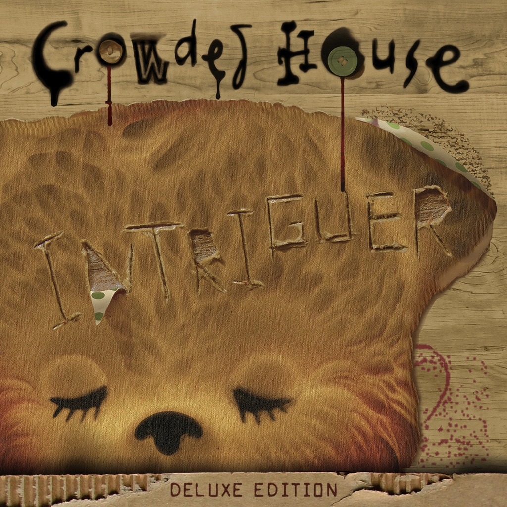

<!-- section break -->

1. Saturday Sun (3:26)
2. Archer's Arrows (4:05)
3. Amsterdam (3:35)
4. Either Side Of The World (4:35)
5. Falling Dove (4:35)
6. Isolation (4:37)
7. Twice If You're Lucky (3:33)
8. Inside Out (3:19)
9. Even If (4:03)
10. Elephants (4:31)

<!-- section break -->

## Spotify


## Videos
### Crowded House - Twice If You're Lucky
 

## Release Information
|  Key           | Value                                                |
| ---------------| ---------------------------------------------------- |
| Release Year   | 2010                                   |
| Discogs Link   | [Crowded House - Intriguer](https://www.discogs.com/release/2388576-Crowded-House-Intriguer) |
| Label          | Universal Music Group International |
| Format         | Vinyl LP Album |
| Catalog Number | 00602527415185 |
| Notes | Recorded at Roundhead Studios, Auckland May-Aug 09 Mixed at PLYRZ Studios, LA Mastered @ Gateway Mastering & DVD Portland. Additional recording @ Exchequer Studios, Dublin. Additional recording & mixing @ PLYRZ Studios Aug 25-Sept 25 2009.  Preorder from Neil Finn site were signed by Neil, Nick, Mark and Matt on cover  |