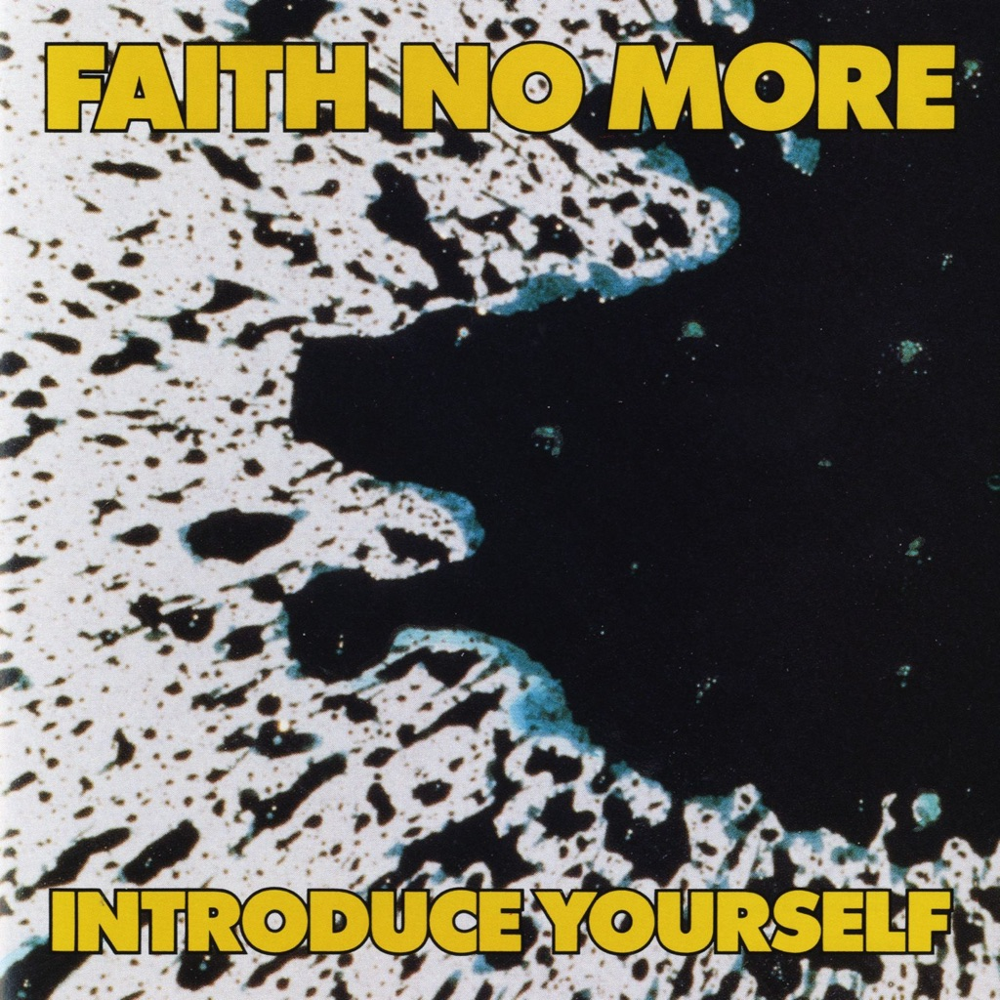

<!-- section break -->

1. Faster Disco (4:17)
2. Anne's Song (4:47)
3. Introduce Yourself (1:30)
4. Chinese Arithmetic (4:36)
5. Death March (2:59)
6. We Care A Lot (4:01)
7. R n' R (3:11)
8. The Crab Song (5:52)
9. Blood (3:39)
10. Spirit (2:50)

<!-- section break -->

## Spotify


## Videos
### Chinese Arithmetic
 

### More Videos

- [Faster Disco](https://www.youtube.com/watch?v=x-AhE32UPw8)
- [Anne's Song](https://www.youtube.com/watch?v=-W4RwQhNIUk)
- [Introduce Yourself](https://www.youtube.com/watch?v=KuVUx8cADWs)
- [Death March](https://www.youtube.com/watch?v=lrROABXAn8Q)
- [Faith No More - We Care a Lot (Official Music Video)](https://www.youtube.com/watch?v=LQhX8PbNUWI)
- [R N' R](https://www.youtube.com/watch?v=jID0GrUstMQ)
- [The Crab Song](https://www.youtube.com/watch?v=QFYymqpBBkg)
- [Blood](https://www.youtube.com/watch?v=hWRKWkpQBAk)
- [Spirit](https://www.youtube.com/watch?v=oFPjpDmDq-U)

## Release Information
|  Key           | Value                                                |
| ---------------| ---------------------------------------------------- |
| Release Year   | 1987                                   |
| Discogs Link   | [Faith No More - Introduce Yourself](https://www.discogs.com/release/652381-Faith-No-More-Introduce-Yourself) |
| Label          | Slash |
| Format         | Vinyl LP Album |
| Catalog Number | 25559-1 |
| Notes | This version was pressed at Allied Record Company and is otherwise identical to the version [url=http://www.discogs.com/release/4354696]made at Specialty Records Corporation[/url].    Catalogue number 25559-1 is printed on the spine of the sleeve. 1-25559 is printed on the face labels.    Recorded at Studio D, Sausalito, CA. / Control Center, Los Angeles, CA.   Mixed at Studio D, Sausalito, CA.    © 1987 Slash Records ℗ 1987 Slash Records.  Distributed by Warner Bros. Records, Inc.  Made in USA.    Allied Record Company and Sheffield Lab Matrix are not directly credited but have identified from information ion the vinyl runout area. |