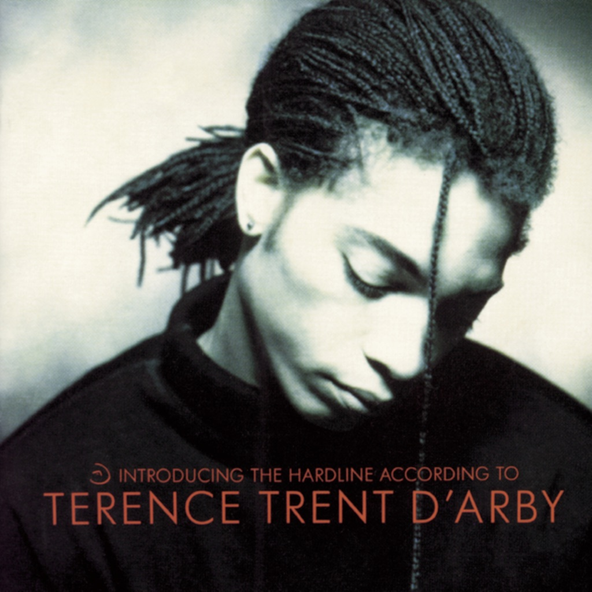

<!-- section break -->

1. If You All Get To Heaven
2. If You Let Me Stay
3. Wishing Well
4. I’ll Never Turn My Back On You (Father’s Words)
5. Dance Little Sister
6. Seven More Days
7. Let’s Go Forward
8. Rain
9. Sign Your Name
10. As Yet Untitled
11. Who’s Loving You

<!-- section break -->

## Videos
### Sananda Maitreya - If You All Get To Heaven (Remastered - Official Audio)
 

### More Videos

- [Terence Trent D'Arby - LP Introducing the Hardline According  - Sign Your Name](https://www.youtube.com/watch?v=7ALdICJVsvM)
- [If You All Get To Heaven: Terence Trent D'Arby *HQ*](https://www.youtube.com/watch?v=funBT_8jBMw)
- [Sananda Maitreya - If You Let Me Stay](https://www.youtube.com/watch?v=hMhEzd9Bsb4)
- [Sananda Maitreya - If You Let Me Stay (Remastered - Official Audio)](https://www.youtube.com/watch?v=jvVGkLIgA3k)
- [Sananda Maitreya - Wishing Well (Video)](https://www.youtube.com/watch?v=ynIHsHYaig0)
- [Sananda Maitreya - Wishing Well (Remastered - Official Audio)](https://www.youtube.com/watch?v=1p6aS18SHqQ)
- [Sananda Maitreya - Dance Little Sister (Official Video)](https://www.youtube.com/watch?v=OlmKCj03fHw)
- [I'll Never Turn My Back On You (Father's Words) (Remastered - Official Audio)](https://www.youtube.com/watch?v=XNiJPwD_wzs)
- [Sananda Maitreya - Dance Little Sister (Remastered - Official Audio)](https://www.youtube.com/watch?v=SdUE-QH-vWE)
- [Sananda Maitreya - Seven More Days (Remastered - Official Audio)](https://www.youtube.com/watch?v=nt-8MNoH-KQ)
- [Sananda Maitreya - Let's Go Forward (Remastered - Official Audio)](https://www.youtube.com/watch?v=TLSRNsOrids)
- [Sananda Maitreya - Rain (Remastered - Official Audio)](https://www.youtube.com/watch?v=V-KkA9jn2iI)
- [Sananda Maitreya - Sign Your Name (Remastered - Official Audio)](https://www.youtube.com/watch?v=iLVLfL3QVQQ)
- [Sananda Maitreya - As Yet Untitled (Remastered - Official Audio)](https://www.youtube.com/watch?v=KaorrPeR3_A)
- [Sananda Maitreya - Who's Loving You (Remastered - Official Audio)](https://www.youtube.com/watch?v=yy28FjJxICA)

## Release Information
|  Key           | Value                                                |
| ---------------| ---------------------------------------------------- |
| Release Year   | 1987                                   |
| Discogs Link   | [Terence Trent D'Arby - Introducing The Hardline According To Terence Trent D'Arby](https://www.discogs.com/release/9174511-Terence-Trent-DArby-Introducing-The-Hardline-According-To-Terence-Trent-DArby) |
| Label          | CBS |
| Format         | Vinyl LP Album |
| Catalog Number | CBS 450911 1 |
| Notes | Labels: Made in Holland  Back cover: ℗ 1987 CBS Records © 1987 CBS Records Printed in Holland Distribution CBS Records/CBS Disques S.A. In the UK apply for public performance licences to PPL, 14/22 Ganton Street, London W1.  Inner sleeve: Original sound recording made by CBS Records ℗ 1987 CBS Records All tracks (Young Terence Music/Virgin Music (Pub) Ltd) except "Wishing Well" (Young Terence Music/Virgin Music (Pub) Ltd/Chrysalis Music) and "Who's Loving You" (Ardmore & Beechwood Ltd/EMI)  Other infos: Issued with printed inner sleeve with lyrics, credits and photo.  The Bojangles are the musicians named on track A4, who also feature on A5 and, without Pete Glenister, on B2 and B5. The Trent Tones are Frank Collins and Ebo Ross, the backing vocalists on B2 & B5. The 'Shout It Out' Reply Vocal Choral Ensemble are the members of A5's Chorus. The sleeve credits read: "Plus A Really Hard Brass Section" in addition to those listed for track A5.  Smokey Robinson is credited for writing track B5 on the label, however as William Robinson on the inner sleeve.  |