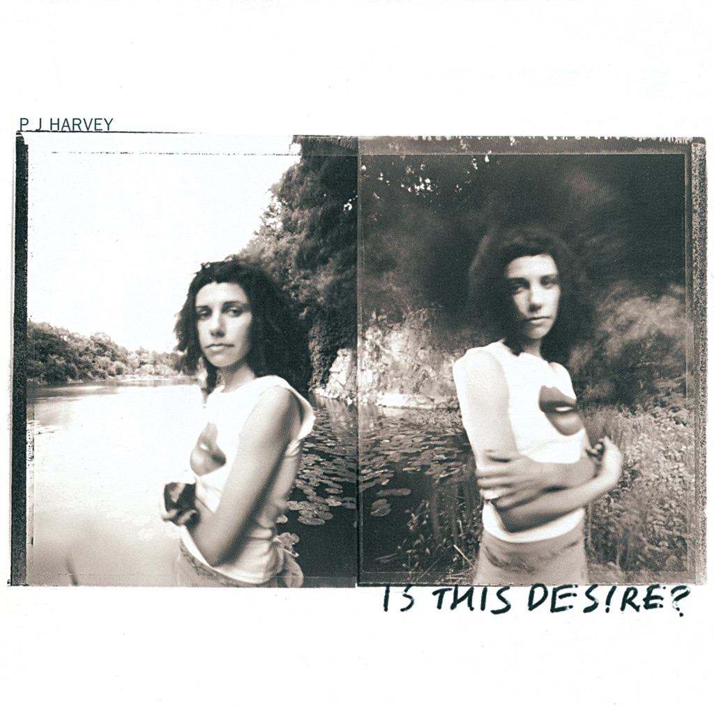

<!-- section break -->

1. Angelene (3:26)
2. The Sky Lit Up (1:54)
3. The Wind (3:59)
4. My Beautiful Leah (1:59)
5. A Perfect Day Elise (3:03)
6. Catherine (3:57)
7. Electric Light (3:05)
8. The Garden (4:09)
9. Joy (3:39)
10. The River (4:49)
11. No Girl So Sweet (2:48)
12. Is This Desire? (3:19)

<!-- section break -->

## Spotify


## Videos
### Is This Desire?
 

### More Videos

- [PJ Harvey - The Wind](https://www.youtube.com/watch?v=GmOMuBYEejc)
- [PJ Harvey - A Perfect Day Elise](https://www.youtube.com/watch?v=D3tD9EPOEik)
- [PJ Harvey - Angelene](https://www.youtube.com/watch?v=m8XzHhC9czw)
- [The River](https://www.youtube.com/watch?v=6g1nCs_9HCk)
- [Catherine](https://www.youtube.com/watch?v=PbAKMz-Lv7E)

## Release Information
|  Key           | Value                                                |
| ---------------| ---------------------------------------------------- |
| Release Year   | 2021                                   |
| Discogs Link   | [PJ Harvey - Is This Desire?](https://www.discogs.com/release/17061660-P-J-Harvey-Is-This-Desire) |
| Label          | Island Records |
| Format         | Vinyl LP Album Reissue (180 Gram) |
| Catalog Number | 0898528 |
| Notes | Some copies include a hype sticker and download card.  Hype sticker with catalog # 0898528:  Re-issue of the original 1998 album Is This Desire?, featuring the singles A Perfect Day Elise and The Wind  Pressed on 180gsm vinyl  Includes download card  Includes a printed inner sleeve with lyrics, credits and artwork.  An Island Records Release. ℗1998 Universal Music Operations Ltd. ©1998 Universal Music Operations Ltd. The copyright in this recording and artwork is owned by Universal Music Operations Ltd. A Universal Music Company. Universal International Music B.V., 's-Gravelandseweg 80, 1217 EW Hilversum, Netherlands. Made in Germany.  Recorded at Small World Studios, Yeovil and Whitfield Street Studios, London, April '97 - April '98 Mixed at Whitfield Street  Vinyl cutting [...] at Loud  Hot Head Music Limited (ASCAP), administered by Kobalt Songs Music Publishing (ASCAP) except track A3 Hot Head Music Limited (ASCAP), administered by Kobalt Songs Music Publishing (ASCAP) / Warner-Tamerlane Publishing Corp (BMI) 'The Wind' contains portions of 'Planet Of The Apes' (J. Goldsmith) Warner-Tamerlane Publishing Corp (BMI)  First catalog # (0898528) on jacket spine, back, side B label, inner sleeve. Second catalog # (00602508985287) on jacket back, side B label.  Runouts are etched, Optimal plating symbols are mirrored.  Track durations not printed on release. |