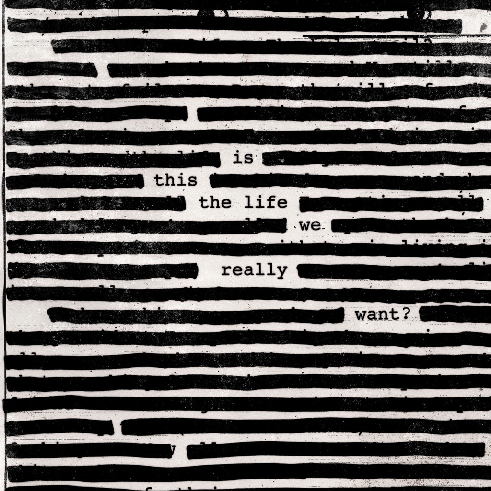

<!-- section break -->

1. When We Were Young
2. Deja Vu
3. The Last Refugee
4. Picture That
5. Broken Bones
6. Is This The Life We Really Want?
7. Bird In A Gale
8. The Most Beautiful Girl
9. Smell The Roses
10. Wait For Her
11. Oceans Apart
12. Part Of Me Died

<!-- section break -->

## Spotify


## Videos
### Part of Me Died
 

### More Videos

- [Roger Waters - The Last Refugee](https://www.youtube.com/watch?v=_XdLNqWYgGI)
- [Roger Waters - Wait for Her (Video)](https://www.youtube.com/watch?v=iSl1kmQMG2E)
- [Bird In A Gale](https://www.youtube.com/watch?v=BQxx9R8l6ZY)
- [The Most Beautiful Girl](https://www.youtube.com/watch?v=GtPON4OH_tE)

## Release Information
|  Key           | Value                                                |
| ---------------| ---------------------------------------------------- |
| Release Year   | 2018                                   |
| Discogs Link   | [Roger Waters - Is This The Life We Really Want?](https://www.discogs.com/release/12213433-Roger-Waters-Is-This-The-Life-We-Really-Want) |
| Label          | Columbia |
| Format         | Vinyl 2× LP Album Limited Edition Numbered Reissue (Green) |
| Catalog Number | C-192609 |
| Notes | Comes in a gatefold cover, inner sleeves with lyrics. Download code included. Made in the EU.  Parental Advisory Explicit Content Strong Language  Hype sticker: Numbered Limited Edition Green Vinyl  Number is stamped in silver on front cover. |