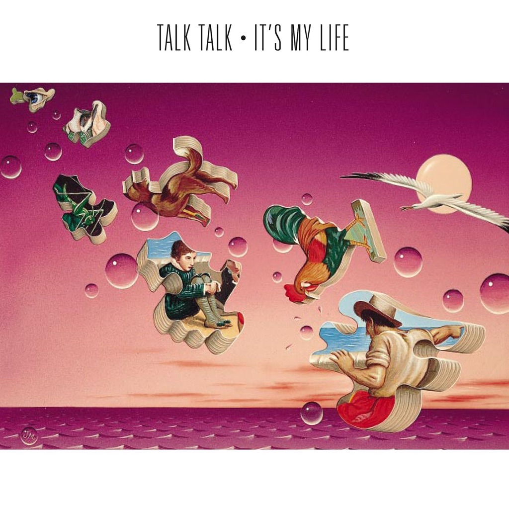

<!-- section break -->

1. Dum Dum Girl
2. Such A Shame
3. Renée
4. It's My Life
5. Tomorrow Started
6. The Last Time
7. Call In The Night Boy
8. Does Caroline Know?
9. It's You

<!-- section break -->

## Spotify


## Videos
### Does Caroline Know? (1997 Remaster)
 

### More Videos

- [Talk Talk - It's My Life ( Official Video)](https://www.youtube.com/watch?v=cFH5JgyZK1I)
- [Dum Dum Girl (1997 Remaster)](https://www.youtube.com/watch?v=dzMhTPl-uv0)
- [Talk Talk - Such A Shame (Official Video)](https://www.youtube.com/watch?v=lLdvpFIPReA)
- [Talk Talk - Such A Shame (Album Version) (HQ)](https://www.youtube.com/watch?v=ZILD_vKEoNE)
- [Renee (1997 Remaster)](https://www.youtube.com/watch?v=KfB-iIrJy-s)
- [It's My Life (1997 Remaster)](https://www.youtube.com/watch?v=yWQezjGjiqs)
- [Tomorrow Started (1997 Remaster)](https://www.youtube.com/watch?v=F5s0oynBz7M)
- [The Last Time (1997 Remaster)](https://www.youtube.com/watch?v=dsDpI1TiQMs)
- [Call in the Night Boy (1997 Remaster)](https://www.youtube.com/watch?v=WIj4hC9v0Hs)
- [It's You (1997 Remaster)](https://www.youtube.com/watch?v=xYMOv6XR5ts)

## Release Information
|  Key           | Value                                                |
| ---------------| ---------------------------------------------------- |
| Release Year   | 2020                                   |
| Discogs Link   | [Talk Talk - It's My Life](https://www.discogs.com/release/16032806-Talk-Talk-Its-My-Life) |
| Label          | Parlophone |
| Format         | Vinyl LP Album Limited Edition Reissue Repress Stereo (Purple Translucent, 180g) |
| Catalog Number | 0190295195328 / 0190295792619 |
| Notes | Hype sticker reads: LIMITED EDITION 180g PURPLE VINYL. 0190295195328 Barcode sticker on reverse of the shrink wrap obscures the barcode on the cover.  ℗ 1984 Parlophone Records Ltd. © 2017 Parlophone Records Ltd. A Warner Music Group Company Manufactured in the EU  Released in the U.S. on 15 Jan 2021 as part of [url=https://www.discogs.com/label/33244-Rhino-Records-2]Rhino's[/url] 'Start Your Ear Off Right' reissue campaign for 2021. |