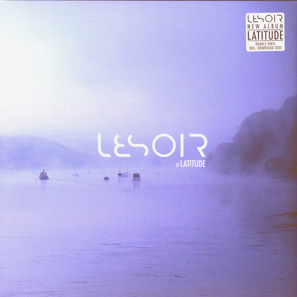

<!-- section break -->

1. Modern Goddess (4:31)
2. In The Game (5:27)
3. Icon (4:02)
4. In Their Eyes (7:24)
5. Gone And Forgotten (5:31)
6. Eden's Garden (6:45)
7. Zeroes And Ones (4:10)
8. Kissed By Sunlight (4:58)
9. Cheap Trade (3:10)
10. Comforting Rain (4:16)
11. Latitude (3:39)
12. Faith Is (6:21)
13. Cradle Song (1:55)

<!-- section break -->

## Videos
### In Their Eyes
 

### More Videos

- [Latitude](https://www.youtube.com/watch?v=t3zBRu3b4RU)
- [Lesoir Latitude (GAOM054)](https://www.youtube.com/watch?v=L8vaclL7Ojc)

## Release Information
|  Key           | Value                                                |
| ---------------| ---------------------------------------------------- |
| Release Year   | 2017                                   |
| Discogs Link   | [Lesoir - IV Latitude](https://www.discogs.com/release/11219448-Lesoir-IV-Latitude) |
| Label          | Gentle Art Of Music |
| Format         | Vinyl 2× LP Album |
| Catalog Number | GAOM 054LP |
| Notes | Ordered Directly by the Band to get a Signed edition. Includes a download card. |