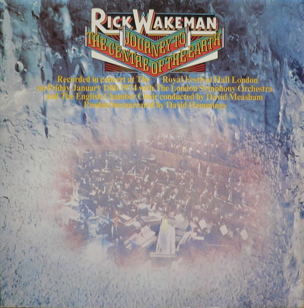

<!-- section break -->

1. The Journey
2. Recollection
3. The Battle
4. The Forest

<!-- section break -->

## Spotify


## Videos
### RICK WAKEMAN JOURNEY TO THE CENTRE OF THE EARTH 2012 (full album)
 

### More Videos

- [Rick Wakeman - The Forest](https://www.youtube.com/watch?v=0pNVkkXqprk)
- [Rick Wakeman Journey to the Centre of the Earth Full Album 1974   YouTube](https://www.youtube.com/watch?v=YJ9W2pZwvlY)
- [Rick Wakeman-Journey To The Center Of The Earth](https://www.youtube.com/watch?v=8wFag3o10wg)
- [Rick Wakeman   The Battle vinyl](https://www.youtube.com/watch?v=88ZZgQ_MAX4)
- [Rick Wakeman   The Journey Recollection vinyl](https://www.youtube.com/watch?v=Bf7yzb8Iokk)

## Release Information
|  Key           | Value                                                |
| ---------------| ---------------------------------------------------- |
| Release Year   | 1974                                   |
| Discogs Link   | [Rick Wakeman - Journey To The Centre Of The Earth](https://www.discogs.com/release/1606192-Rick-Wakeman-Journey-To-The-Centre-Of-The-Earth) |
| Label          | A&M Records |
| Format         | Vinyl LP Album Stereo (Gatefold Sleeve) |
| Catalog Number | AMLH 63621 |
| Notes | Recorded in concert at The Royal Festival Hall London on Friday January 18th 1974.  Production narrated by David Hemmings.  Recorded by Ronnie Lane’s “Lyn Mobile Studio”. Mixed at Morgan Studios, London on 21st-29th January 1974.  Rondor Music (London) Ltd.  Garry Pickford-Hopkins appears by courtesy of Chrysalis Records Ltd.  Sleeve printed and made in England by Gothic Print Finshers Ltd., London, SE9. Released with a booklet fixed into the center of the GF sleeve. The sleeves inner panels effectively make up the first 2 pages of the booklet. Different label image on [r449230] |