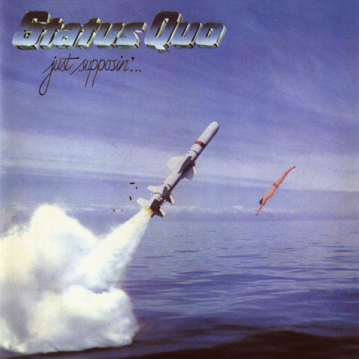

<!-- section break -->

1. What You're Proposing (4:15)
2. Run To Mummy (3:08)
3. Don't Drive My Car (4:30)
4. Lies (3:56)
5. Over The Edge (4:29)
6. The Wild Ones (3:53)
7. Name Of The Game (4:26)
8. Coming And Going (6:20)
9. Rock 'N' Roll (5:23)

<!-- section break -->

## Videos
### Status Quo – Don't Drive My Car
 

### More Videos

- [Status Quo – What You're Proposin'](https://www.youtube.com/watch?v=z4Zh5DyMRDU)
- [Status Quo – Rock 'n' Roll](https://www.youtube.com/watch?v=UGuPCJcj3As)
- [Status Quo – Lies](https://www.youtube.com/watch?v=Q4yckEtH-jQ)

## Release Information
|  Key           | Value                                                |
| ---------------| ---------------------------------------------------- |
| Release Year   | 2015                                   |
| Discogs Link   | [Status Quo - Just Supposin'...](https://www.discogs.com/release/7581302-Status-Quo-Just-Supposin) |
| Label          | Vertigo |
| Format         | Vinyl LP Album Reissue |
| Catalog Number | 4723773 |
