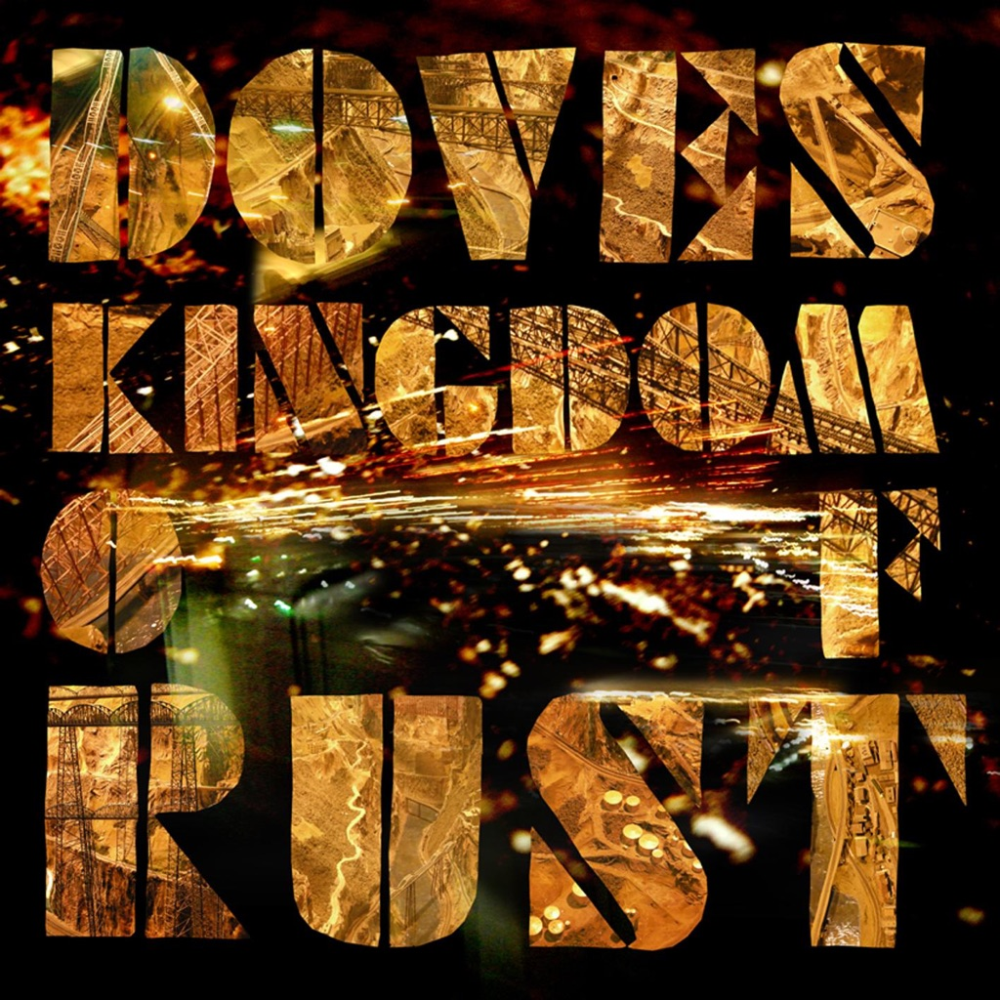

<!-- section break -->

1. Jetstream (5:30)
2. Kingdom Of Rust (5:09)
3. The Outsiders (3:25)
4. Winter Hill (5:17)
5. 10:03 (4:03)
6. The Greatest Denier (3:55)
7. Birds Flew Backwards (2:50)
8. Spellbound (5:38)
9. Compulsion (5:12)
10. House Of Mirrors (4:14)
11. Lifelines (4:24)

<!-- section break -->

## Spotify


## Videos
### Doves - Kingdom of rust [Kingdom of rust] Music video
 

## Release Information
|  Key           | Value                                                |
| ---------------| ---------------------------------------------------- |
| Release Year   | 2022                                   |
| Discogs Link   | [Doves - Kingdom Of Rust](https://www.discogs.com/release/25227943-Doves-Kingdom-Of-Rust) |
| Label          | Heavenly Recordings |
| Format         | Vinyl 2× LP Limited Edition Reissue (Gold Vinyl) |
| Catalog Number | 0888252 |
| Notes | Exclusive to the Doves official store, Sound Of Vinyl & Recordstore (Universal Music stores) on heavyweight double gold vinyl, hand numbered. Limited edition of 2000. |