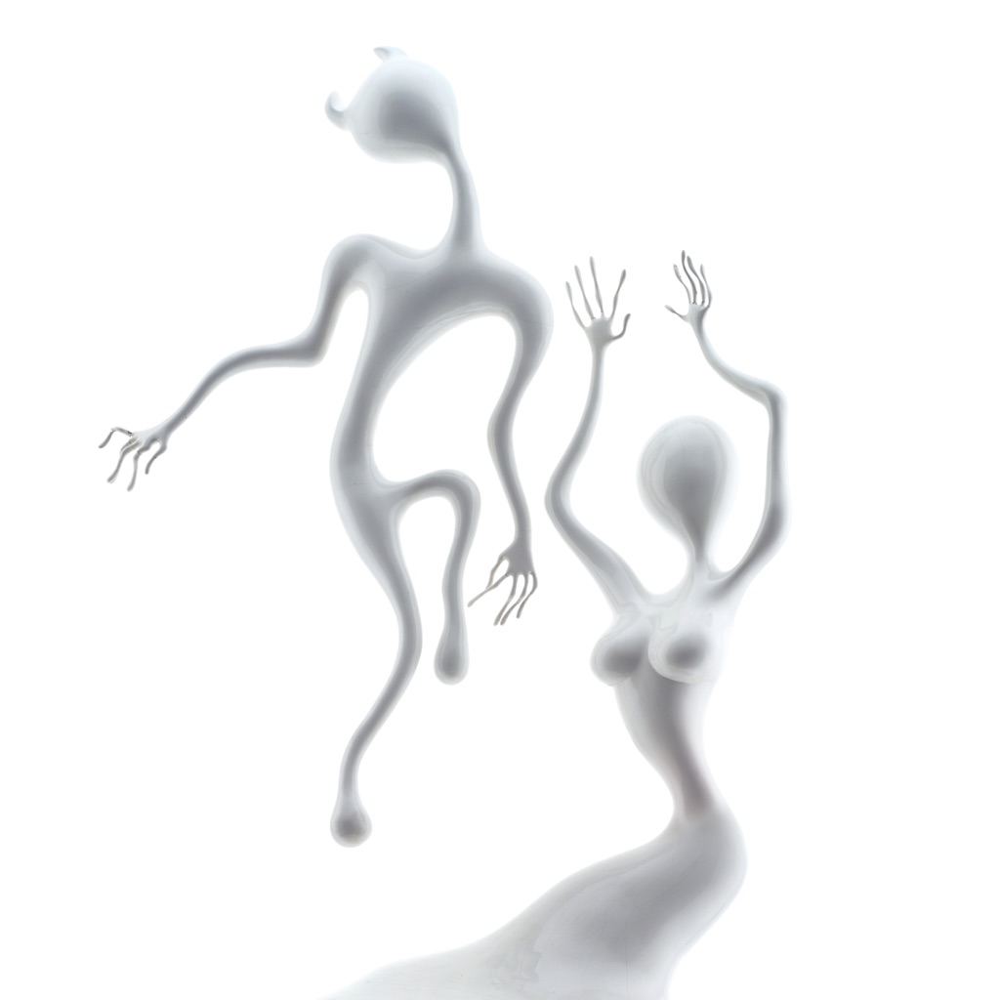

<!-- section break -->

1. You Know It's True
2. If I Were With Her Now
3. I Want You
4. Run
5. Smiles
6. Step Into The Breeze
7. Symphony Space
8. Take Your Time
9. Shine A Light
10. Angel Sigh
11. Sway
12. 200 Bars

<!-- section break -->

## Spotify


## Videos
### If I Were with Her Now
 

### More Videos

- [You Know It's True](https://www.youtube.com/watch?v=1jt6Do5O2mg)
- [Spiritualized - Run (Video)](https://www.youtube.com/watch?v=NtVuqjd5oSc)
- [Spiritualized - Lazer Guided Melodies (Full Album Stream)](https://www.youtube.com/watch?v=gkPPxLm50V0)
- [I Want You](https://www.youtube.com/watch?v=EcaKOuChJlk)
- [Run](https://www.youtube.com/watch?v=VD8x88wzyI4)
- [Smiles](https://www.youtube.com/watch?v=SGmITeLvXKM)
- [Step into the Breeze](https://www.youtube.com/watch?v=1B7NpPeYhoc)
- [Symphony Space](https://www.youtube.com/watch?v=5V-9R2PxksA)
- [Take Your Time](https://www.youtube.com/watch?v=HuGbad6R6Mw)
- [Shine a Light](https://www.youtube.com/watch?v=3Qv2HhmHW2U)
- [Angel Sigh](https://www.youtube.com/watch?v=p836NG1DDGw)
- [Sway](https://www.youtube.com/watch?v=2GbDePAXSdo)
- [200 Bars](https://www.youtube.com/watch?v=R-th3jQW80A)

## Release Information
|  Key           | Value                                                |
| ---------------| ---------------------------------------------------- |
| Release Year   | 2021                                   |
| Discogs Link   | [Spiritualized - Lazer Guided Melodies](https://www.discogs.com/release/18366628-Spiritualized-Lazer-Guided-Melodies) |
| Label          | Fat Possum Records |
| Format         | Vinyl 2× 12" 45 RPM Album Limited Edition Reissue Special Edition (White, 180 Gram) |
| Catalog Number | FP1751-3 |
| Notes | Lazer Guided Melodies is the first installment in Fat Possum's four-part "[l2182069]".  This limited special edition pressed on 180g white vinyl and housed in a gatefold sleeve with heavyweight custom inner sleeves.  Available from Fat Possum's webstore, Bandcamp, VMP, and various indie retailers (standard black vinyl edition [url=https://www.discogs.com/release/18407173]here[/url]).  On Mastering & Manufacturing: Per Fat Possum, this release "...mastered from a half speed lacquer cut from original sources by Alchemy Mastering".  Per side A runout, Alchemy's senior mastering engineer, Barry Grint ("Bazza"), did the mastering/cutting. Again per runouts, GZ Media manufactured metal stampers from Alchemy's lacquer master. And, finally, Memphis Record Pressing used GZ's stampers to press the vinyl.  On Runouts, Sides A-D: Each runout includes both stamped and hand-etched sections and characters. For the most part, sections consisting of stamped characters are inverted (upside-down) relative to the hand-etched sections. For simplicity's sake, runouts are recorded here in sectional sequence, as encountered by the traveling needle, with inverted sections in reading order.  Selected Sleeve Text: Original 16 track recordings by Paul Adkins at VHF Sound Centre, Rugby, November 1990. Additional recording at Moles Studio, Bath by Mike Long, May 1991. Angel Sigh recorded by Angus Wallace at Far Heath Studio, Northamptonshire, July 1991. Originally produced by J. Spaceman.  Mixed at Gooseberry Studio, London, January 1992. 200 Bars and Symphony Space mixed at Comforts Place Studios, January 1992.  ...The artwork for this special edition features new photographs of the model figures made for the original album artwork. The figures were made by Gavin Lindsay, based on a drawing by Mr Ugly (Nicholas Brooker).  In loving memory of Nicholas "Natty" Brooker.  Some copies from fatpossum.com came with 2 badges - a red one and a blue one.  300 copies were available exclusively from Rough Trade which included an art print of the cover. (Catalog Number FP17513PRINT) |