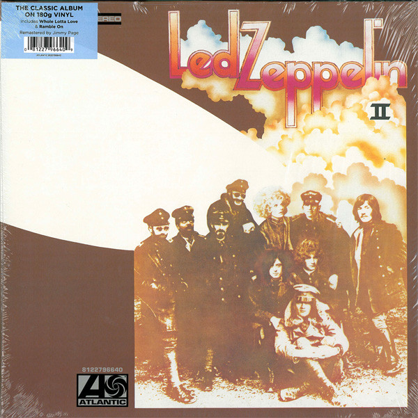

<!-- section break -->

1. Whole Lotta Love (5:34)
2. What Is And What Should Never Be (4:44)
3. The Lemon Song (6:19)
4. Thank You (4:47)
5. Heartbreaker (4:14)
6. Living Loving Maid (She's Just A Woman) (2:39)
7. Ramble On (4:23)
8. Moby Dick (4:21)
9. Bring It On Home (4:20)

<!-- section break -->

## Spotify


## Release Information
|  Key           | Value                                                |
| ---------------| ---------------------------------------------------- |
| Release Year   | 2014                                   |
| Discogs Link   | [Led Zeppelin - Led Zeppelin II](https://www.discogs.com/release/5734489-Led-Zeppelin-Led-Zeppelin-II) |
| Label          | Atlantic |
| Format         | Vinyl LP Album Reissue Remastered Stereo (180 g, Gatefold) |
| Catalog Number | 8122796640 |
| Notes | Housed in a gatefold jacket and issued in a white poly lined inner sleeve. Runouts are etched.  [Gatefold inside:] All selections administered by WB Music Corp. (ASCAP) except 'Bring It On Home' administered by Hoochie Coochie Music BMI. Mixed at A&R Studios, New York, with Eddie Kramer Released October 22, 1969 © 1969 Atlantic Recording Corporation, a Warner Music Group Company. [...] Made in the EU.  [Labels:] © 1969 Atlantic Recording Corporation. ℗ 2013 Atlantic Recording Corporation. Manufactured in Germany. |