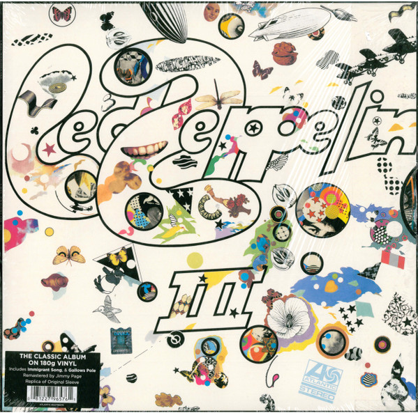

<!-- section break -->

1. Immigrant Song (2:26)
2. Friends (3:53)
3. Celebration Day (3:30)
4. Since I've Been Loving You (7:24)
5. Out On The Tiles (4:07)
6. Gallows Pole (4:57)
7. Tangerine (3:11)
8. That's The Way (5:37)
9. Bron-Y-Aur Stomp (4:17)
10. Hats Off To (Roy) Harper (3:42)

<!-- section break -->

## Spotify


## Release Information
|  Key           | Value                                                |
| ---------------| ---------------------------------------------------- |
| Release Year   | 2014                                   |
| Discogs Link   | [Led Zeppelin - Led Zeppelin III](https://www.discogs.com/release/5734538-Led-Zeppelin-Led-Zeppelin-III) |
| Label          | Atlantic |
| Format         | Vinyl LP Album Reissue Remastered Stereo (180g, Gatefold) |
| Catalog Number | 8122796576 |
| Notes | ℗ & © 1970. Labels: Manufactured in Germany. Sleeve: Made in EU. Sticker:  "The Classic Album on 180g Vinyl. Includes Immigrant Song, & Gallows Pole Remastered by Jimmy Page Replica of Original Sleeve."  Gatefold with working wheel.  Catalog number "8122796576" appears on the sticker, spine and inner gatefold while "R1 535341" appears on the label.  Runouts are etched. Runout side A, variant 3: "4 +V" is mirrored and upside down Runout side B, variant 3: "5 VI" is mirrored and upside down |