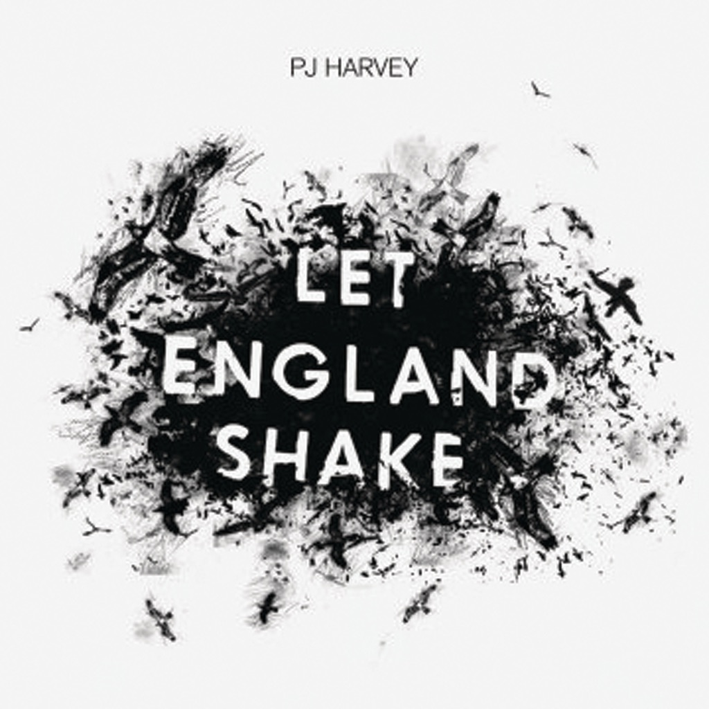

<!-- section break -->

1. Let England Shake
2. The Last Living Rose
3. The Glorious Land
4. The Words That Maketh Murder
5. All And Everyone
6. On Battleship Hill
7. England
8. In The Dark Places
9. Bitter Branches
10. Hanging In The Wire
11. Written On The Forehead
12. The Colour Of The Earth

<!-- section break -->

## Spotify


## Videos
### PJ Harvey - Let England Shake
 

### More Videos

- [PJ Harvey - The Glorious Land](https://www.youtube.com/watch?v=YBtOWXNPQ_w)
- [PJ Harvey - On Battleship Hill](https://www.youtube.com/watch?v=VO63vb1S7Cw)

## Release Information
|  Key           | Value                                                |
| ---------------| ---------------------------------------------------- |
| Release Year   | 2011                                   |
| Discogs Link   | [PJ Harvey - Let England Shake](https://www.discogs.com/release/2709851-PJ-Harvey-Let-England-Shake) |
| Label          | Island Records |
| Format         | Vinyl LP Album |
| Catalog Number | 2758997 |
| Notes | Made in Dorset, April - May 2010. Mixed at Assault & Battery.  Published by Hot Head Music Ltd./EMI Music Publishing Ltd. except: Track A1 Xylophone Melody adapted from the song 'Istanbul (Not Constantinople)'. Track A3 contains elements from 'The Bed's Too Big Without You' by The Police; also includes a sample of 'Regimental March' bugle call. Track A4 contains elements from 'Summertime Blues'. Track B1 contains a sample of 'Kassem Miro'. Track B5 contains a sample of 'Blood & Fire'. Tracks A5 & B6 inspired by the writings of L.A. Carlyon & the words of Vic Nicholson in 'Voices Of Gallipoli' by Maurice Shadbolt. Tracks A3 & B2 are inspired in part by extracts from 'Russian Folk Lyrics', edited and translated by Roberta Reeder, with an Introductory Essay by V. Ja. Propp.  ℗2010 Universal Island Records Ltd. ©2010 Universal Island Records Ltd. A Universal Music Company.  Made in the EU  Pressing plant and cutting facility/engineer derived from matrix.  Runouts are machine-etched, only "JONZ LOUDº¯" is hand-etched. |