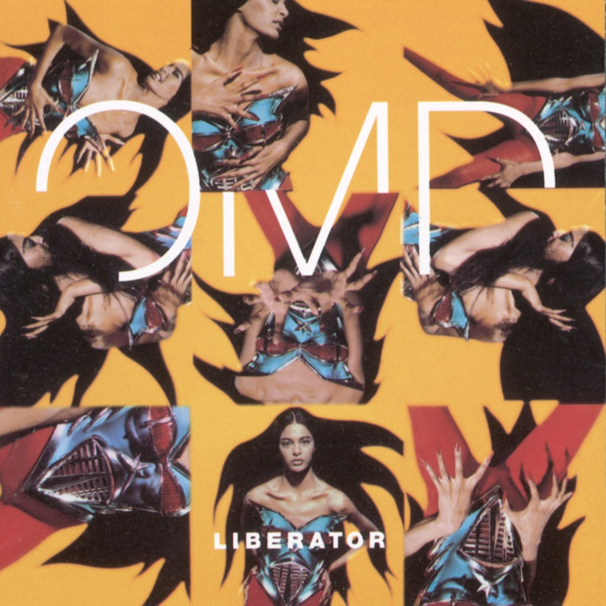

<!-- section break -->

1. Stand Above Me (3:33)
2. Everyday (3:57)
3. King Of Stone (4:17)
4. Dollar Girl (4:19)
5. Dream Of Me (Based On Love's Theme) (4:13)
6. Sunday Morning (3:23)
7. Agnus Dei (3:39)
8. Love And Hate You (3:18)
9. Heaven Is (4:30)
10. Best Years Of Our Lives (4:35)
11. Christine (5:04)
12. Only Tears (4:14)

<!-- section break -->

## Spotify


## Videos
### Christine
 

### More Videos

- [Dream Of Me (Based On Love's Theme)](https://www.youtube.com/watch?v=Vc-d3FGoxDI)
- [Orchestral Manoeuvres In The Dark - Stand Above Me](https://www.youtube.com/watch?v=HewK0qkT7OI)
- [Love And Hate You](https://www.youtube.com/watch?v=WoIo7_zvBuE)
- [Best Years Of Our Lives](https://www.youtube.com/watch?v=xY1fe9h7l7E)
- [Agnus Dei](https://www.youtube.com/watch?v=5ScXTwAF8TY)
- [Heaven Is](https://www.youtube.com/watch?v=8Q13k_EQwyA)
- [Stand Above Me](https://www.youtube.com/watch?v=cTrkwjwasB8)
- [Only Tears](https://www.youtube.com/watch?v=duHtik7Ph48)
- [King Of Stone](https://www.youtube.com/watch?v=pLh8r5yNXQU)
- [Dollar Girl](https://www.youtube.com/watch?v=KT-1fnFOzuM)

## Release Information
|  Key           | Value                                                |
| ---------------| ---------------------------------------------------- |
| Release Year   | 2021                                   |
| Discogs Link   | [Orchestral Manoeuvres In The Dark - Liberator](https://www.discogs.com/release/19761730-OMD-Liberator) |
| Label          | EMI |
| Format         | Vinyl LP Album Reissue Remastered |
| Catalog Number | 0602435422497 |
| Notes | An EMI release. ℗ 2021 Virgin Records Ltd. © 2021 Virgin Records Ltd. Universal International Music B.V. 's-Gravelandseweg 80, 1217 EW Hilversum, Netherlands. Made in Germany. Includes download card (WAV files). |