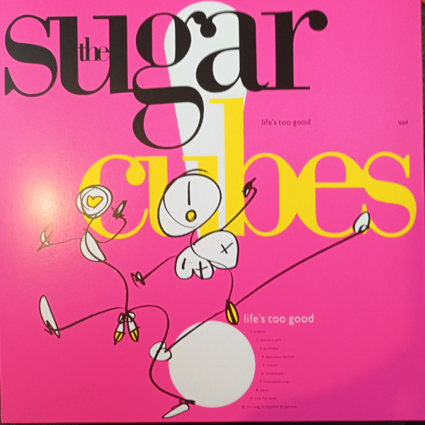

<!-- section break -->

1. Traitor (3:08)
2. Motorcrash (2:22)
3. Birthday (3:57)
4. Delicious Demon (2:41)
5. Mama (2:54)
6. Coldsweat (3:16)
7. Blue Eyed Pop (2:36)
8. Deus (4:07)
9. Sick For Toys (3:12)
10. F***ing In Rhythm & Sorrow (3:11)
11. Take Some Petrol Darling (1:27)

<!-- section break -->

## Spotify


## Videos
### Deus
 

### More Videos

- [Traitor](https://www.youtube.com/watch?v=xAb5-GDu3uE)
- [Motor Crash](https://www.youtube.com/watch?v=yl3IOefc82M)
- [Birthday](https://www.youtube.com/watch?v=oTeVFbmzMVM)
- [Delicious Demon](https://www.youtube.com/watch?v=vtHPokwW__M)
- [Mama](https://www.youtube.com/watch?v=j7evlD1od0I)
- [Cold Sweat](https://www.youtube.com/watch?v=WpBkaT6G1kI)
- [Blue Eyed Pop](https://www.youtube.com/watch?v=3ogbi9fT184)
- [Sick For Toys](https://www.youtube.com/watch?v=1qBNQ3taC58)
- [F***ing In Rhythm And Sorrow](https://www.youtube.com/watch?v=Zida7dnffkM)
- [Take Some Petrol Darling](https://www.youtube.com/watch?v=zmSH84SYbcI)

## Release Information
|  Key           | Value                                                |
| ---------------| ---------------------------------------------------- |
| Release Year   | 2022                                   |
| Discogs Link   | [The Sugarcubes - Life's Too Good](https://www.discogs.com/release/22346299-The-Sugarcubes-Lifes-Too-Good) |
| Label          | One Little Independent Records |
| Format         | Vinyl LP Album Limited Edition Reissue (Pink) |
| Catalog Number | tplp5 |
| Notes | Limited edition of 500 copies.  Comes with a Rough Trade Essential Edition obi and a barcode sticker on the plastic seal on the back.  The labels still show the track numbers of the original release (side A as 1-5 and side B as 6-10), with track B6 not mentioned on release, as with all previous releases.  From back sleeve: warmest thanks to frikki por his input. welcome to melax. recorded at: studio syrland, reykjavik. berry st. studios, london. orinocco studios, london.  Made in England. |