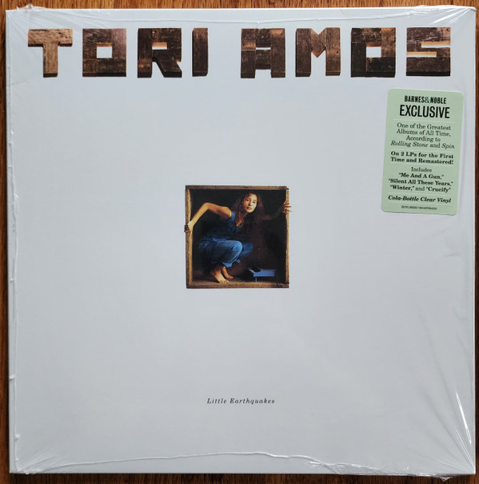

<!-- section break -->

1. Crucify (4:58)
2. Girl (4:06)
3. Silent All These Years (4:11)
4. Precious Things (4:26)
5. Winter (5:41)
6. Happy Phantom (3:13)
7. China (4:59)
8. Leather (3:12)
9. Mother (6:59)
10. Tear In Your Hand (4:38)
11. Me And A Gun (3:44)
12. Little Earthquakes (6:52)

<!-- section break -->

## Spotify


## Videos
### Tori Amos - Silent All These Years (Official Music Video)
 

### More Videos

- [Tori Amos - Winter (Official Music Video)](https://www.youtube.com/watch?v=_PDlGUdDF8Y)
- [Tori Amos - Crucify [Music Video]](https://www.youtube.com/watch?v=q8ljHOSqc4A)

## Release Information
|  Key           | Value                                                |
| ---------------| ---------------------------------------------------- |
| Release Year   | 2023                                   |
| Discogs Link   | [Tori Amos - Little Earthquakes](https://www.discogs.com/release/25684807-Tori-Amos-Little-Earthquakes) |
| Label          | Atlantic |
| Format         | Vinyl 2× LP Album Reissue Remastered Special Edition Stereo (Green Translucent [Cola-Bottle Clear]) |
| Catalog Number | R1 82358 |
| Notes | Double Vinyl  Barnes & Noble Exclusive Cola-Bottle Clear Vinyl Debut solo album.   Release produced by Tori Amos Audio Supervision Mark Hawley Remastered in 2022 by Jon Astley for Close to the Edge Half-Speed master cut at Abbey Road Studio, London by Miles Showell  1st and 2nd cat #'s are printed on the spine and insert, 3rd and 4th printed on labels and hype sticker. |