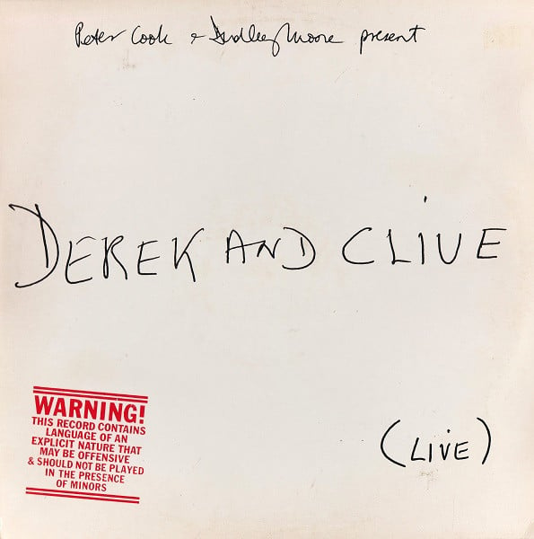

<!-- section break -->

1. The Worst Job I Ever Had
2. This Bloke Came Up To Me
3. The Worst Job He Ever Had
4. Squatter And The Ant
5. In The Lav
6. Little Flo
7. Just One Of Those Songs
8. Winkie Wanky Woo
9. Bo Duddley
10. Blind
11. Top Rank
12. Cancer
13. Jump

<!-- section break -->

## Videos
### Derek and Clive - Live - Bo Duddley
 

### More Videos

- [Derek and Clive - 'Derek and Clive (Live)' - Full album](https://www.youtube.com/watch?v=-2ezqpFWnfU)
- [Derek and Clive Live: This Bloke Came Up To Me (Peter Cook & Dudley Moore) 2/13](https://www.youtube.com/watch?v=RYGy-j_oH5Q)
- [Derek and Clive Live: Worst Job I Ever Had (Peter Cook & Dudley Moore) 1/13](https://www.youtube.com/watch?v=_a_UKKvUcoE)

## Release Information
|  Key           | Value                                                |
| ---------------| ---------------------------------------------------- |
| Release Year   | 1976                                   |
| Discogs Link   | [Peter Cook & Dudley Moore - (Live)](https://www.discogs.com/release/561172-Peter-Cook-Dudley-Moore-Present-Derek-And-Clive-Live) |
| Label          | Island Records |
| Format         | Vinyl LP Album |
| Catalog Number | ILPS 9434 |
