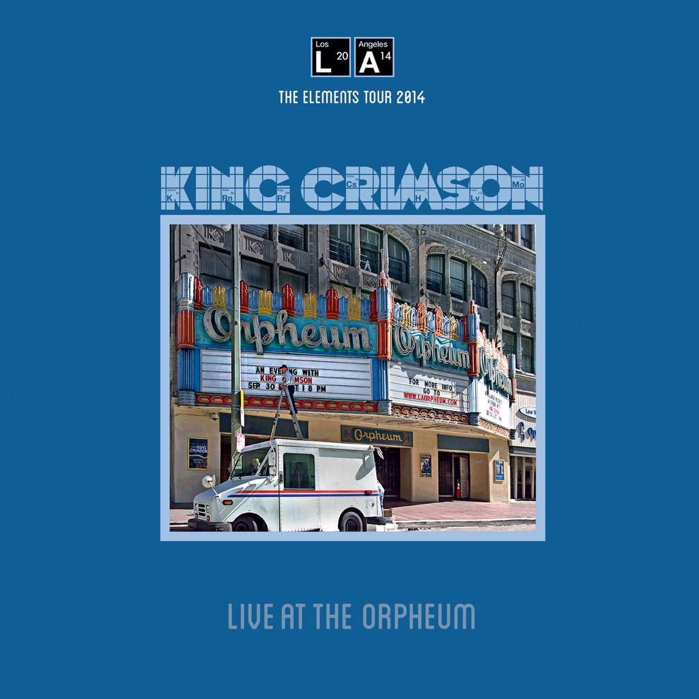

<!-- section break -->

1. Walk On: Monk Morph Chamber Music (2:34)
2. One More Red Nightmare (6:07)
3. Banshee Legs Bell Hassle (1:40)
4. The ConstruKction Of Light (6:32)
5. The Letters (4:57)
6. Sailor's Tale (6:51)
7. Starless (12:15)

<!-- section break -->

## Spotify


## Release Information
|  Key           | Value                                                |
| ---------------| ---------------------------------------------------- |
| Release Year   | 2015                                   |
| Discogs Link   | [King Crimson - Live At The Orpheum](https://www.discogs.com/release/6596408-King-Crimson-Live-At-The-Orpheum) |
| Label          | Discipline Global Mobile |
| Format         | Vinyl LP Album Limited Edition |
| Catalog Number | DGMLV1 |
| Notes | Gatefold Sleeve.  200 Gram Super Heavyweight Vinyl.  The Elements Tour 2014 : Live at the Orpheum Theatre, Los Angeles, CA, September 30 & October 1.  ℗ & © 2015 Robert Fripp on behalf of King Crimson  Made in England. |