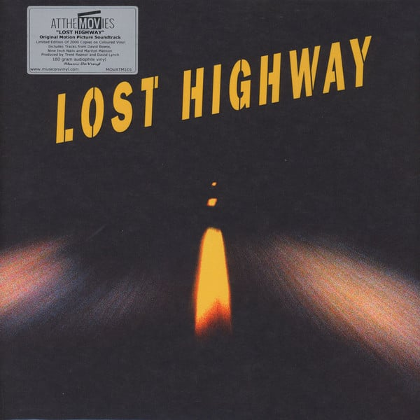

<!-- section break -->

1. I'm Deranged (Edit) (2:38)
2. Videodrones; Questions (0:44)
3. The Perfect Drug (5:15)
4. Red Bats With Teeth (2:57)
5. Haunting & Heartbreaking (2:08)
6. Eye (4:51)
7. Dub Driving (3:43)
8. Mr. Eddy's Theme 1 (3:31)
9. This Magic Moment (3:23)
10. Mr. Eddy's Theme 2 (2:13)
11. Fred & Renee Make Love (2:04)
12. Apple Of Sodom (4:26)
13. Insensatez (2:53)
14. Something Wicked This Way Comes (Edit) (2:54)
15. I Put A Spell On You (3:30)
16. Fats Revisited (2:31)
17. Fred's World (3:00)
18. Rammstein (Edit) (3:26)
19. Hollywood Sunset (2:01)
20. Heirate Mich (Edit) (3:02)
21. Police (1:39)
22. Driver Down (5:18)
23. I'm Deranged (Reprise) (3:47)

<!-- section break -->

## Videos
### Lost Highway Soundtrack 05. Haunting & Heartbreaking
 

### More Videos

- [Lost Highway Soundtrack 01. I’m Deranged (Edit)](https://www.youtube.com/watch?v=oHxkDIvbyGg)
- [Videodrones; Questions](https://www.youtube.com/watch?v=ji_BZmgB1OM)
- [The Perfect Drug](https://www.youtube.com/watch?v=pa5YJRcfCfM)
- [Red Bats With Teeth](https://www.youtube.com/watch?v=k-e08eBbNv0)
- [Eye](https://www.youtube.com/watch?v=kmqS01NMips)
- [Dub Driving](https://www.youtube.com/watch?v=9lCxWbKB1iI)
- [Mr. Eddy's Theme 1](https://www.youtube.com/watch?v=ksRRT7eoJFo)
- [This Magic Moment](https://www.youtube.com/watch?v=fP-mlrMv7Ok)
- [Mr. Eddy's Theme 2](https://www.youtube.com/watch?v=5GhEn4-VtRE)
- [Fred & Renee Make Love](https://www.youtube.com/watch?v=bCgEAeMZEpI)
- [Apple Of Sodom](https://www.youtube.com/watch?v=TzgkwXjWuEg)
- [Lost Highway Soundtrack 13. Insensatez](https://www.youtube.com/watch?v=YuZvHfuyIT8)
- [Lost Highway Soundtrack 14. Something Wicked This Way Comes](https://www.youtube.com/watch?v=vSshzmKOlCE)
- [I Put A Spell On You](https://www.youtube.com/watch?v=jy7Q1nt-4PE)
- [Fats Revisited](https://www.youtube.com/watch?v=Zy9NTRgUXqU)
- [Fred's World](https://www.youtube.com/watch?v=vi5uEJi2nkI)
- [Rammstein (Edit)](https://www.youtube.com/watch?v=x6jtEnLJncM)
- [Hollywood Sunset](https://www.youtube.com/watch?v=L8SyzCv9OxY)
- [Heirate Mich (Edit)](https://www.youtube.com/watch?v=r2AInopKBWM)
- [Police](https://www.youtube.com/watch?v=eP6IQ3Vfuho)
- [Driver Down](https://www.youtube.com/watch?v=PxBGukgq2cM)
- [Lost Highway Soundtrack 23. I’m Deranged (Reprise)](https://www.youtube.com/watch?v=yrb9QKVEMvM)

## Release Information
|  Key           | Value                                                |
| ---------------| ---------------------------------------------------- |
| Release Year   | 2016                                   |
| Discogs Link   | [Various - Lost Highway (Original Motion Picture Soundtrack)](https://www.discogs.com/release/9274768-Various-Lost-Highway-Original-Motion-Picture-Soundtrack) |
| Label          | Music On Vinyl |
| Format         | Vinyl 2× LP Compilation Deluxe Edition Limited Edition Numbered Reissue (Yellow With A Tip Of Black, Gatefold, 180g) |
| Catalog Number | MOVATM101 |
| Notes | Limited to 2000 copies. Title lettering on the sleeve is embossed. A printed inner sheet with info is also included.  Track 14 contains excerpts from: "Spooky", written by H.Middlesbrooke, M.Shapiro, B.Buie and J.R.Cobb (performed by [url=http://www.discogs.com/artist/Classics+IV,+The]The Classics IV[/url]); "Blue Lines", written by R.Del Naja, G.Marshall, A.Vowles and A.Thaws (performed by [url=http://www.discogs.com/artist/Massive+Attack]Massive Attack[/url]); "Le Temps Des Souvenirs", written by J.J.Datin, M.Vidalin and C.Blackwell (performed by [url=http://www.discogs.com/artist/Fran%C3%A7oise+Hardy]Françoise Hardy[/url]).  1, 23. © 1995 Tintoretto Music Administered by RZO Music, Inc. (BMI) and Ulapa Music, Inc. 3. © 1996 Leaving Hope Music/TVT Music (ASCAP), D. Lohner 4, 5, 7, 11, 16, 17, 21. © 1996 Avalon Music/Bobkind Music (ASCAP) 6. © 1996 Chrysalis Songs/Cinderful Music (BMI) Recorded at Soundworks (Chicago). Mixed at Chung King (New York) 8, 10, 19. © 1996 Mute Song/Bobkind Music (ASCAP) 9. © 1960 Unichappell Music, Inc (BMI) 12. © 1996 Dinger & Ollie Music/Beat Up Your Mom Music (BMI) 13. © 1963 Duchess Music Corporation 15. © 1956 Copyright renewed 1984 Unart Music Corporation 18, 20. ©  Edition Rammstein administered in The BMG UFA Musikverlage administered in The US by BMG Songs, Inc. (ASCAP) 22. © 1996 Leaving Hope Music/TVT Music (ASCAP)   Made in the EU.  |