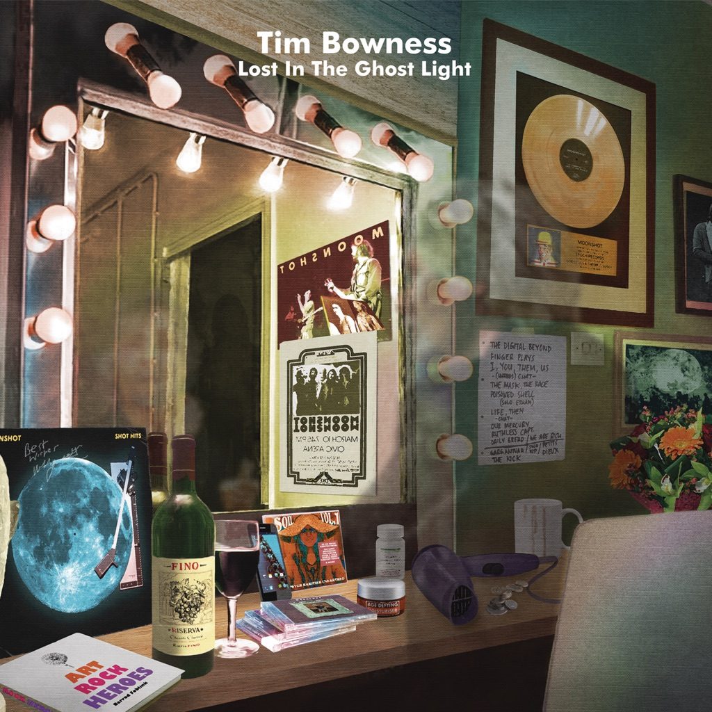

<!-- section break -->

1. Worlds Of Yesterday (5:41)
2. Moonshot Manchild (8:58)
3. Kill The Pain That's Killing You (3:44)
4. Nowhere Good To Go (4:46)
5. You'll Be The Silence (9:01)
6. Lost In The Ghost Light (1:40)
7. You Wanted To Be Seen (5:32)
8. Distant Summers (4:06)
9. Worlds Of Yesterday (5:41)
10. Moonshot Manchild (8:58)
11. Kill The Pain That's Killing You (3:44)
12. Nowhere Good To Go (4:46)
13. You'll Be The Silence (9:01)
14. Lost In The Ghost Light (1:40)
15. You Wanted To Be Seen (5:32)
16. Distant Summers (4:06)

<!-- section break -->

## Spotify


## Videos
### Tim Bowness - Kill the Pain That's Killing You
 

### More Videos

- [Tim Bowness - Lost In The Ghost Light album trailer](https://www.youtube.com/watch?v=MSh-64nnnSM)

## Release Information
|  Key           | Value                                                |
| ---------------| ---------------------------------------------------- |
| Release Year   | 2017                                   |
| Discogs Link   | [Tim Bowness - Lost In The Ghost Light](https://www.discogs.com/release/9852036-Tim-Bowness-Lost-In-The-Ghost-Light) |
| Label          | Inside Out Music |
| Format         | Vinyl LP Album (Gold), CD Album, All Media Limited Edition Numbered |
| Catalog Number | IOMLP 473 |
| Notes | Gold vinyl + CD in gatefold. Limited to 400 copies. Burning Shed mailorder exclusive including postcard signed by Tim Bowness.  Tracks durations as indicated on release back. |