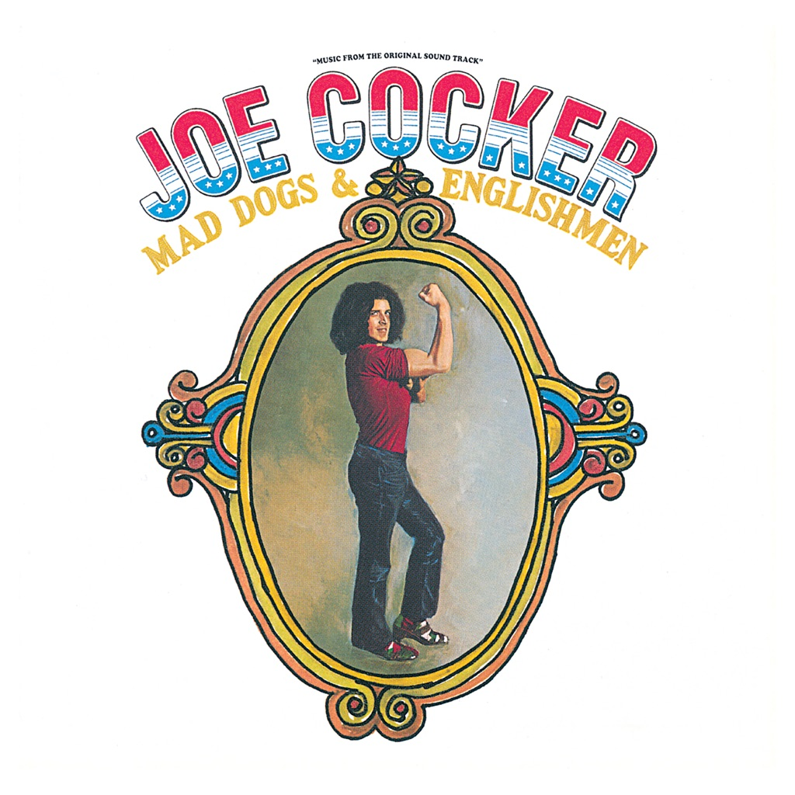

<!-- section break -->

1. Introduction (0:45)
2. Honky Tonk Woman (3:35)
3. Introduction (0:10)
4. Sticks And Stones (2:30)
5. Cry Me A River (3:50)
6. Bird On The Wire (6:15)
7. Feelin´ Alright (5:30)
8. Superstar (4:55)
9. Introduction (0:15)
10. Let´s Get Stoned (7:15)
11. Blue Medley (12:47)
12. Introduction (0:20)
13. Girl From The North Country (2:30)
14. Give Peace A Chance (4:20)
15. Introduction (0:40)
16. She Came In Thru The Bathroom Window (2:50)
17. Space Captain (4:55)
18. The Letter (4:20)
19. Delta Lady (5:35)

<!-- section break -->

## Spotify


## Videos
### MAD DOGS AND ENGLISHMEN - SECOND SET FILLMORE EAST
 

### More Videos

- [Joe Cocker - Sticks and Stones (Mad Dogs & Englishmen)](https://www.youtube.com/watch?v=79YmYQebXzE)
- [MAD DOGS AND ENGLISHMEN @ THE FILLMORE EAST](https://www.youtube.com/watch?v=Ia-IoPMR9Uo)
- [Joe Cocker  - Mad Dogs & Englishmen - Space Captain](https://www.youtube.com/watch?v=-407iUd_pFY)
- [The Letter (Live At The Fillmore East/1970)](https://www.youtube.com/watch?v=LlX5IWwizGg)
- [J̤o̤e̤ ̤C̤o̤c̤k̤e̤r̤-̤M̤a̤d̤ Dogs & .... (Deluxe Edition)[Full Album HQ]](https://www.youtube.com/watch?v=tr7EOkIgiqo)
- [Joe Cocker, Mad Dogs and Englishmen - Honky Tonky Woman (LIVE) HD](https://www.youtube.com/watch?v=P8tqpe99QJw)
- [Joe Cocker - Feelin' Alright - Mad Dogs & Englishmen (April 1970 - Fillmore East, NYC)](https://www.youtube.com/watch?v=uJMzuGVQRyc)
- [Something (Set 1 / Live At The Fillmore East/3/28/70)](https://www.youtube.com/watch?v=EIjikyrW8ak)
- [Joe Cocker, Mad Dogs and Englishmen - Mad Dogs & Englishmen Theme](https://www.youtube.com/watch?v=YrK5GZGqxNg)
- [Joe Cocker (Mad Dogs & Englishmen) - Side 1](https://www.youtube.com/watch?v=7WdO95H_k-4)
- [Honky Tonk Women (With Intro / Set 1 / Live At The Fillmore East/1970)](https://www.youtube.com/watch?v=mkR-RCx2CTo)
- [Joe Cocker Feelin' Alright Mad Dogs & Englishmen (1970)](https://www.youtube.com/watch?v=Xy3NFzw_cfY)
- [Delta Lady (Set 2 / Live At The Fillmore East/1970)](https://www.youtube.com/watch?v=cXwD6mBxFgM)
- [Joe Cocker, Mad Dogs and Englishmen - Something (LIVE) HD](https://www.youtube.com/watch?v=kiT5J61f588)
- [Joe Cocker - Mad Dogs & Englishmen - With A Little Help From My Friends](https://www.youtube.com/watch?v=n6splB7acXc)

## Release Information
|  Key           | Value                                                |
| ---------------| ---------------------------------------------------- |
| Release Year   | 2011                                   |
| Discogs Link   | [Joe Cocker - Mad Dogs & Englishmen](https://www.discogs.com/release/3339945-Joe-Cocker-Mad-Dogs-Englishmen) |
| Label          | Music On Vinyl |
| Format         | Vinyl 2× LP Album Reissue (180 Gram) |
| Catalog Number | MOVLP355 |
| Notes | Comes in a gatefold sleeve  Recorded on March 27-18, 1970 at Fillmore East, New York  ℗ & © 2011 Universal Music B.V. A2 published by Gideon Music Inc. A4 published by Tangerine Music Inc. A5 published by Saunders Publications, Inc. A6 published by Stranger Music Inc. B1 published by Irving Music Inc. B2, C4 published by Skyhill Publishing Co., Inc./Delbon Publishing  B4 published by Baby Monica Music/Renleigh Music C1a published by Jay & Cee Music C1b published by East/Memphis Music Corp. C1c published by East Memphis Music-Time Music Corp. C3 published by M. Witmark & Sons D2 published by Maclen Music Inc. D3, D5 published by Skyhill Publishing Co., Inc. D4 published by Earl Barton Music Inc.  [a255183] appears with love from [l44717] [url=https://www.discogs.com/artist/791783-Don-Preston-2]Don Preston[/url] courtesy of [l59656]    |