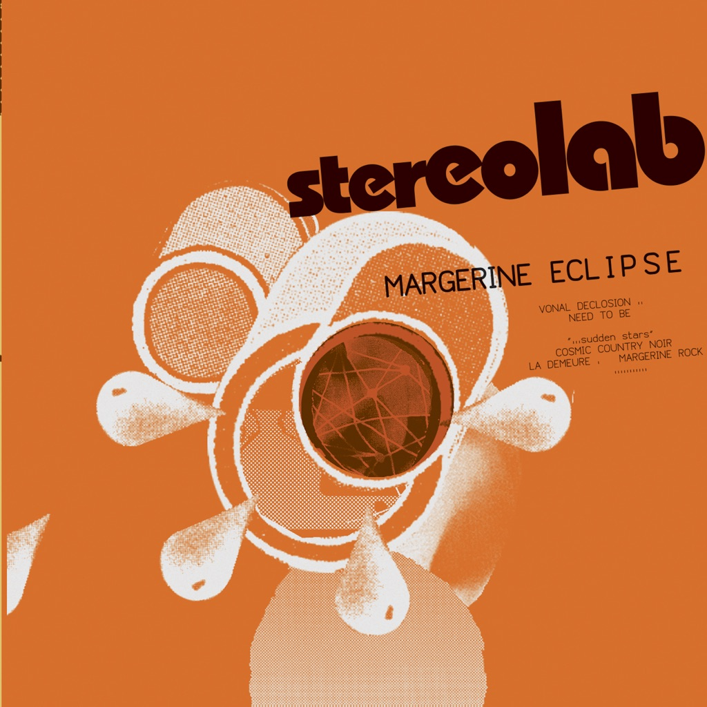

<!-- section break -->

1. Vonal Declosion
2. Need To Be
3. "...Sudden Stars"
4. Cosmic Country Noir
5. La Demeure
6. Margerine Rock
7. The Man With 100 Cells
8. Margerine Melodie
9. Hillbilly Motobike
10. Feel And Triple
11. Bop Scotch
12. Dear Marge
13. Mass Riff
14. Good Is Me
15. Microclimate
16. Mass Riff Instrumental
17. Jaunty Monty And The Bubbles Of Silence
18. Banana Monster Ne Répond Plus
19. University Microfilms International
20. Rose, My Rocket-Brain! (Rose, Le Cerveau Electronique de Ma Fusée!)

<!-- section break -->

## Spotify


## Videos
### Stereolab - Need To Be
 

### More Videos

- [Stereolab - Cosmic Country Noir](https://www.youtube.com/watch?v=DLPtDxWTXLk)
- [Stereolab - Margerine Rock](https://www.youtube.com/watch?v=nXRL2etsV6I)
- [Stereolab - La Demeure](https://www.youtube.com/watch?v=cWtVtDYhBAI)
- [Stereolab - Feel and Triple](https://www.youtube.com/watch?v=_aXEUwbf1S4)
- [Stereolab - Margerine Melodie](https://www.youtube.com/watch?v=YlMqK1vzvBc)

## Release Information
|  Key           | Value                                                |
| ---------------| ---------------------------------------------------- |
| Release Year   | 2019                                   |
| Discogs Link   | [Stereolab - Margerine Eclipse](https://www.discogs.com/release/14452307-Stereolab-Margerine-Eclipse) |
| Label          | Warp Records |
| Format         | Vinyl 2× LP Album Reissue, Vinyl LP, All Media Limited Edition Numbered Remastered (Clear, Expanded Edition) |
| Catalog Number | D-UHF-D29R |
