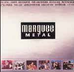

<!-- section break -->

1. We Will Rock You
2. Wishing Well
3. Can't Get Enough
4. Epic
5. She's A Little Angel
6. Killer On The Loose
7. Smoke On The Water
8. Voodoo Chile (Slight Return)
9. Paranoid
10. Down Down
11. Crazy, Crazy Nights
12. School's Out
13. Walk This Way
14. Is There Anybody There
15. The Wizard
16. Days Of No Trust
17. Living After Midnight
18. Free 'N' Easy
19. Ace Of Spades

<!-- section break -->

## Release Information
|  Key           | Value                                                |
| ---------------| ---------------------------------------------------- |
| Release Year   | 1991                                   |
| Discogs Link   | [Various - Marquee Metal](https://www.discogs.com/release/1964892-Various-Marquee-Metal) |
| Label          | PolyGram TV |
| Format         | Vinyl LP Compilation |
| Catalog Number | 845 417-1 |
| Notes | Compilation of popular Rock/Metal cuts.    Studio versions of each track are used - there is nothing here that was recorded at the Marquee club, despite it's branding being featured on the record!!  |