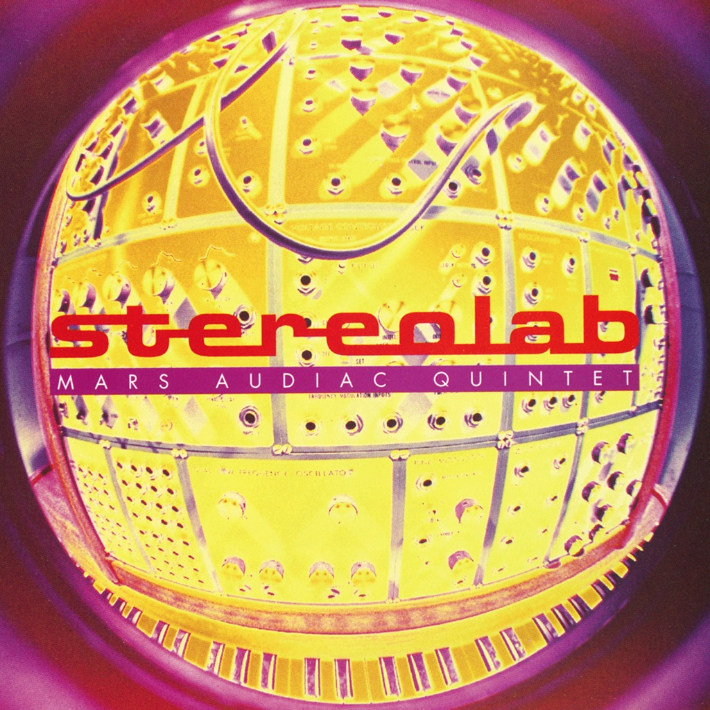

<!-- section break -->

1. Mars Audiac Quintet 
2. Three-Dee Melodie
3. Wow And Flutter
4. Transona Five
5. Des Etoiles Electroniques
6. Ping Pong
7. Anamorphose
8. Three Longers Later
9. Nihilist Assault Group
10. International Colouring Contest
11. The Stars Our Destination
12. Transporte Sans Bouger
13. L'Enfer Des Formes
14. Outer Accelerator
15. New Orthophony
16. Fiery Yellow
17. Demos And Alternate Versions
18. Ulan Bator
19. Klang Tone
20. Melochord Seventy-Five (Original Pulse Version)
21. Outer Accelerator - (Original Mix)
22. Nihilist Assault Group - Part 6
23. Wow And Flutter (7"/EP Version - Alternative Mix)
24. Des Etoile Electroniques - Demo
25. Ping Pong - Demo
26. The Stars Our Destination - Demo
27. Three Longers Later - Demo
28. Transona Five - Demo
29. Transporté Sans Bouger - Demo

<!-- section break -->

## Spotify


## Videos
### Des Etoiles Electroniques
 

### More Videos

- [Three-Dee Melodie](https://www.youtube.com/watch?v=Hm1wLkRJ30U)
- [Wow and Flutter](https://www.youtube.com/watch?v=vyxr9D-r3-o)
- [Transona Five](https://www.youtube.com/watch?v=Dlx3eGq3u_E)
- [Stereolab - L'Enfer Des Formes](https://www.youtube.com/watch?v=Blsw1powe6M)
- [L'Enfer Des Formes](https://www.youtube.com/watch?v=A7UD_Fk-VvY)
- [Ping Pong- Demo](https://www.youtube.com/watch?v=YeCD8Gs8LA0)
- [Outer Accelerator - (Original Mix)](https://www.youtube.com/watch?v=MKz7tZDfb4I)
- [Stereolab - Anamorphose](https://www.youtube.com/watch?v=ksR2AnpgPo0)

## Release Information
|  Key           | Value                                                |
| ---------------| ---------------------------------------------------- |
| Release Year   | 2019                                   |
| Discogs Link   | [Stereolab - Mars Audiac Quintet](https://www.discogs.com/release/13581443-Stereolab-Mars-Audiac-Quintet) |
| Label          | Duophonic Ultra High Frequency Disks |
| Format         | Vinyl 2× LP Album Reissue Remastered, Vinyl LP |
| Catalog Number | D-UHF-D05R |
| Notes | Black vinyl re-issue.  Expanded issue, includes a bonus disk of demos and alternate versions.  Packaged in a gatefold sleeve; all LPs slot into a single panel. Packaged with an outer clear plastic sleeve with hype and bar-code stickers.  Comes with a 4-panel fold out poster with liner notes on the reverse.  A download code is also included.   40 copies were made with obi by Martin Pike and sold through Rough Trade UK. 20 copies were made with a piece of master tape numbered and stamped by Martin Pike and offered to customers whose orders for the clear vinyl edition could not be fulfilled through Rough Trade NYC.  |