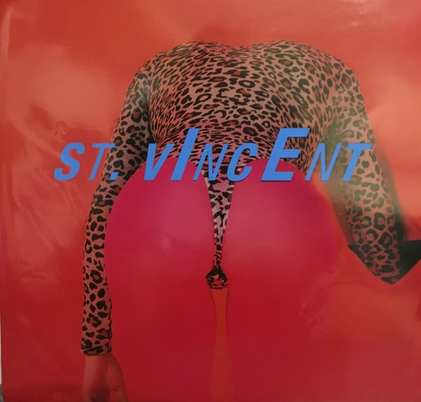

<!-- section break -->

1. Hang On Me (2:48)
2. Pills (4:40)
3. Masseduction (3:17)
4. Sugarboy (4:01)
5. Los Ageless (4:41)
6. Happy Birthday, Johnny (2:58)
7. Savior (3:26)
8. New York (2:34)
9. Fear The Future (2:31)
10. Young Lover (3:33)
11. Dancing With A Ghost (0:46)
12. Slow Disco (2:44)
13. Smoking Section (3:37)

<!-- section break -->

## Spotify


## Videos
### St. Vincent - Masseduction
 

### More Videos

- [St. Vincent - Hang On Me (Official Audio)](https://www.youtube.com/watch?v=F9WjhPy02gU)
- [St. Vincent - New York (Official Video)](https://www.youtube.com/watch?v=4TPqUvy1vYU)
- [St. Vincent - Power Corrupts (Japanese Bonus Track)](https://www.youtube.com/watch?v=GYLCrGOY_eQ)
- [St. Vincent - Los Ageless (Official Video)](https://www.youtube.com/watch?v=h9TlaYxoOO8)

## Release Information
|  Key           | Value                                                |
| ---------------| ---------------------------------------------------- |
| Release Year   | 2017                                   |
| Discogs Link   | [St. Vincent - Masseduction](https://www.discogs.com/release/10987228-St-Vincent-Masseduction) |
| Label          | Loma Vista |
| Format         | Vinyl LP Album Deluxe Edition Limited Edition (Pink) |
| Catalog Number | LVR00225 |
| Notes | ℗ & © 2017 Lorna Vista Recordings / Concord Music Group Inc  Housed in a 2 colour screen printed PVC sleeve, 24" x 24" foldout poster, sticker sheet, download code card and 28-page A4 booklet.  'Dancing With A Ghost' listed as 'Slow Disco Interlude' on the printed PVC sleeve.  Made in Czech Republic.  Publishing Annie Clark : Big Deal Notes / Nail Polish Manifesto Music (ASCAP) All Rights administered by Words & Music Jack Antonoff : Sony/ATV Songs LLC / Ducky Donath Music (BMI) Joy Williams : Joy Williams (BMI) - EMI Blackwood Music Inc. / Here's To Me Music (BMI) Mark Anthony Spears (Sounwave) : Mark Anthony Spears (ASCAP) - Sony/ATV Allegro / Beat Bully Productions (ASCAP)  Recorded at Electric Lady Studios in New York, NY. Additional recording at Rough Consumer Studio in Brooklyn, NY and Compound Fracture in Los Angeles, CA.  Runouts: 'LVR00224-A-REI RJ' and 'LVR00224-B RJ' are etched, everything else is stamped. |