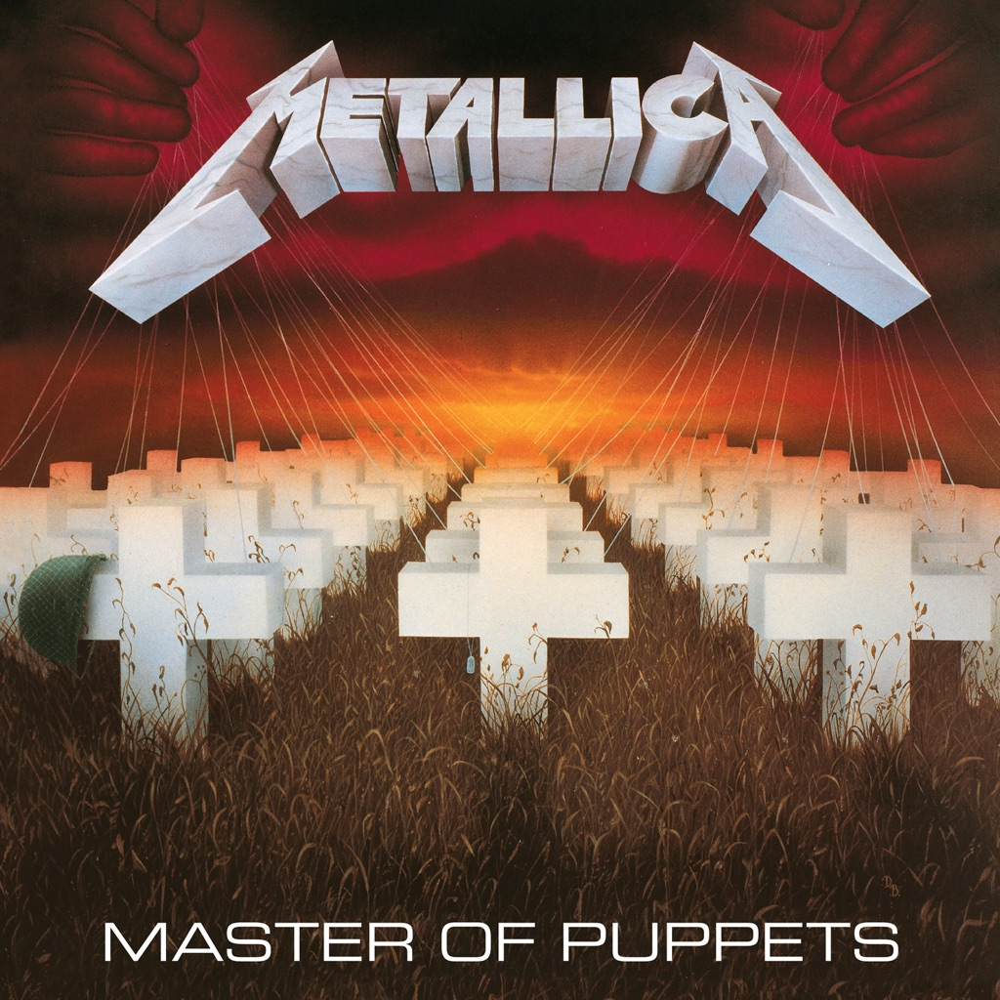

<!-- section break -->

1. Battery (5:10)
2. Master Of Puppets (8:38)
3. The Thing That Should Not Be (6:32)
4. Welcome Home (Sanitarium) (6:28)
5. Disposable Heroes (8:14)
6. Leper Messiah (5:38)
7. Orion (Instrumental) (8:12)
8. Damage, Inc (5:08)

<!-- section break -->

## Spotify


## Videos
### METALLICA Master Of Puppets (new rip in desc)
 

### More Videos

- [METALLICA - Master Of Puppets (Vinilo, LP, Album, Reissue, Remastered, 180 Gram)](https://www.youtube.com/watch?v=QPmVvAGPoIo)
- [Выпуск №209. Metallica – Master Of Puppets(Vinyl, LP, Album, Limited Edition, Reissue, Remastered)](https://www.youtube.com/watch?v=fuZM6xjvWlo)
- [METALLICA (original vs. remaster) Master of Puppets メタリカ メタル・マスター](https://www.youtube.com/watch?v=2ZkgvRbcAiw)
- [Master of Puppets REMASTERED (official album reissue 2017/2018!) Will it sound BETTER as promised?](https://www.youtube.com/watch?v=k7pXAv3cL9A)
- [Metallica - Master of Puppets Remastered HQ](https://www.youtube.com/watch?v=QAOBbPnI5-g)

## Release Information
|  Key           | Value                                                |
| ---------------| ---------------------------------------------------- |
| Release Year   | 2015                                   |
| Discogs Link   | [Metallica - Master Of Puppets](https://www.discogs.com/release/7260112-Metallica-Master-Of-Puppets) |
| Label          | Blackened |
| Format         | Vinyl LP Album Reissue |
| Catalog Number | BLCKND005-1 |
| Notes | [On back cover:] ℗ & © 1986 Blackened Recordings Inc, under exclusive licence to Universal International Music B.V. All rights reserved. Made in the EU.  [On printed inner sheet:] All songs published by Creeping Death Music (ASCAP). |