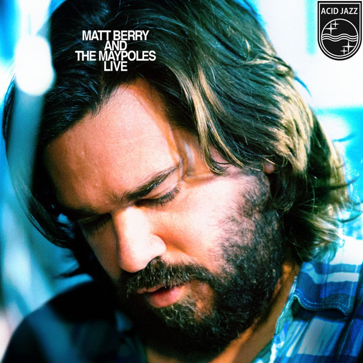

<!-- section break -->

1. The Innkeeper's Song
2. So Low
3. October Sun
4. Take My Hand
5. Sorry (Theme From)
6. Solstice
7. Snuff Box
8. Song For Rosie
9. Medicine
10. Devil Inside Me
11. The Pheasant

<!-- section break -->

## Videos
### Matt Berry & The Maypoles - So Low Live - Tunbridge Wells 2014
 

### More Videos

- [Matt Berry & The Maypoles,  Snuff Box, 13/02/2015](https://www.youtube.com/watch?v=mugYr-k8YGA)

## Release Information
|  Key           | Value                                                |
| ---------------| ---------------------------------------------------- |
| Release Year   | 2015                                   |
| Discogs Link   | [Matt Berry - Matt Berry And The Maypoles Live](https://www.discogs.com/release/7773931-Matt-Berry-3-And-The-Maypoles-Matt-Berry-And-The-Maypoles-Live) |
| Label          | Acid Jazz |
| Format         | Vinyl LP Album (Deep Translucent Blue, Gatefold) |
| Catalog Number | AJX397X |
| Notes | Pressed on 180G, deep translucent blue vinyl. Also contained is a download card. |