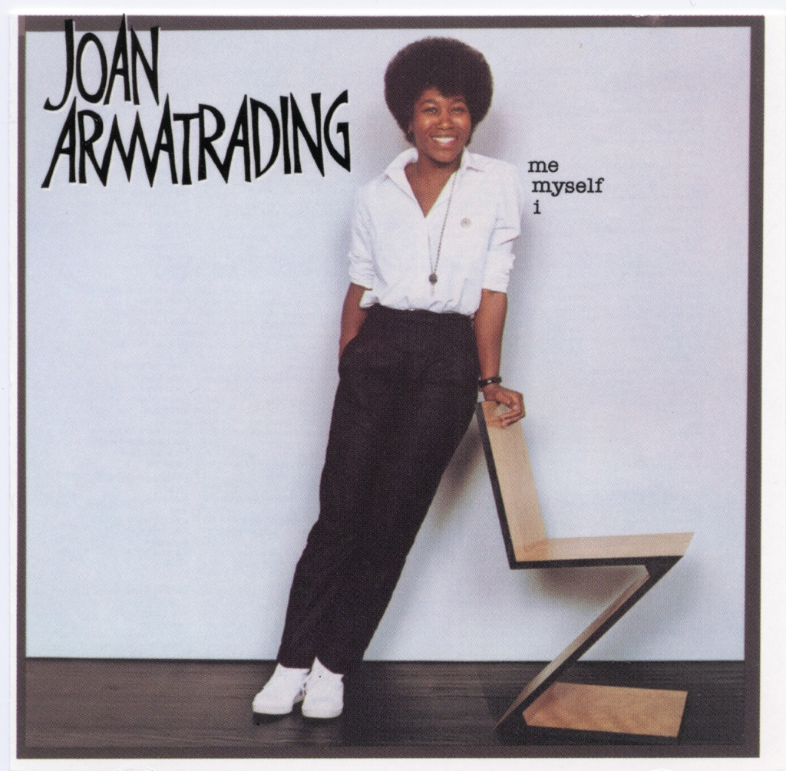

<!-- section break -->

1. Me Myself I (3:16)
2. Ma-Me-O-Beach (3:00)
3. Friends (3:05)
4. Is It Tomorrow Yet (3:31)
5. Turn Out The Light (4:19)
6. When You Kisses Me (3:14)
7. All The Way From America (4:49)
8. Feeling In My Heart (For You) (3:36)
9. Simon (3:40)
10. I Need You (2:44)

<!-- section break -->

## Spotify


## Videos
### Friends
 

### More Videos

- [Ma Me O Beach](https://www.youtube.com/watch?v=K-tf2qFtNFU)
- [Is It Tomorrow Yet?](https://www.youtube.com/watch?v=41VgElN01lo)
- [Turn Out The Light](https://www.youtube.com/watch?v=wg1lJrl3F9Q)
- [Me Myself I](https://www.youtube.com/watch?v=Ibds7i_jLWw)
- [When You Kisses Me](https://www.youtube.com/watch?v=RLAcUsTMxso)
- [All The Way From America](https://www.youtube.com/watch?v=btn3JKLJysc)
- [Feeling In My Heart (For You)](https://www.youtube.com/watch?v=VLfd0Ro0wLE)
- [Simon](https://www.youtube.com/watch?v=gaa_RPDW958)
- [I Need You](https://www.youtube.com/watch?v=9zsuwzoxfDU)
- [joan armatrading - turn out the light](https://www.youtube.com/watch?v=UL99gk3ELvc)

## Release Information
|  Key           | Value                                                |
| ---------------| ---------------------------------------------------- |
| Release Year   | 1980                                   |
| Discogs Link   | [Joan Armatrading - Me Myself I](https://www.discogs.com/release/2414265-Joan-Armatrading-Me-Myself-I) |
| Label          | A&M Records |
| Format         | Vinyl LP Album Stereo |
| Catalog Number | AMLH 64809 |
| Notes | Released with a full colour inner sleeve , one side showing a picture of the artist. © 1980 A & M Records,Ltd. AMLH 64809 on other side.  Some copies are stamped "PROPERTY OF A&M DEMONSTRATION ONLY NOT FOR SALE"  |