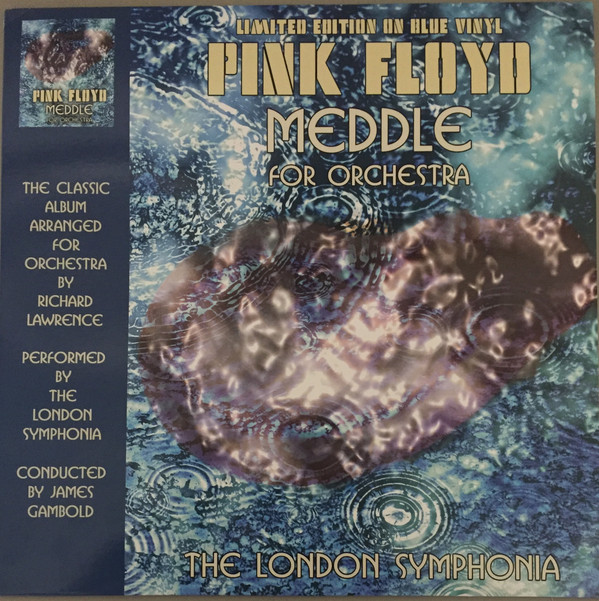

<!-- section break -->

1. Echoes
2. One Of These Days
3. A Pillow Of Winds
4. San Tropez
5. Fearless

<!-- section break -->

## Release Information
|  Key           | Value                                                |
| ---------------| ---------------------------------------------------- |
| Release Year   | 2019                                   |
| Discogs Link   | [Pink Floyd - Meddle For Orchestra](https://www.discogs.com/release/15315298-Pink-Floyd-London-Symphonia-Meddle-For-Orchestra) |
| Label          | Coda Records Ltd |
| Format         | Vinyl LP Album Limited Edition Unofficial Release (Blue) |
| Catalog Number | CRLVNY026 |
