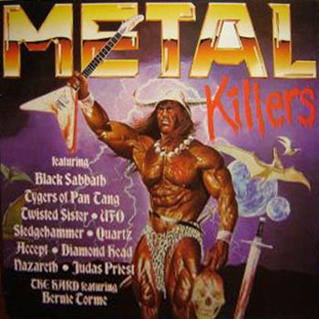

<!-- section break -->

1. Sabbath Bloody Sabbath
2. Destroyer
3. Rocka Rolla
4. Rendezvous
5. Out Of Phase
6. Hottest Woman In Town
7. Fast As A Shark
8. Hair Of The Dog
9. Boogie
10. Stoking Up The Fires Of Hell
11. Under The Blade
12. Lepers Queue

<!-- section break -->

## Spotify


## Videos
### Accept - Fast As A Shark
 

## Release Information
|  Key           | Value                                                |
| ---------------| ---------------------------------------------------- |
| Release Year   | 1984                                   |
| Discogs Link   | [Various - Metal Killers](https://www.discogs.com/release/1916752-Various-Metal-Killers) |
| Label          | Kastle Killers |
| Format         | Vinyl LP Compilation Stereo |
| Catalog Number | KKLP 101 |
| Notes | Courtesy of Heavy Metal Records (Track B1)  |