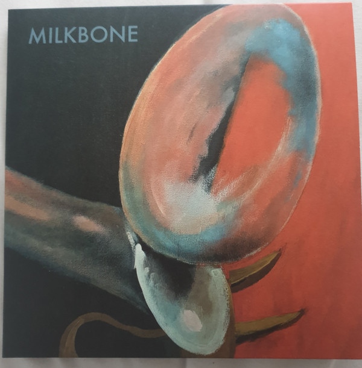

<!-- section break -->

1. Canterbury
2. Leaving Hawksbill
3. Toys Hill
4. Automatic Foot
5. Milkbone
6. Two Sequences
7. Bleak Strategy
8. Soft Weed
9. Red Shift
10. Cecilia
11. Velvet Black

<!-- section break -->

## Videos
### Milkbone Album Trailer
 

## Release Information
|  Key           | Value                                                |
| ---------------| ---------------------------------------------------- |
| Release Year   | 2021                                   |
| Discogs Link   | [Milkbone - Milkbone](https://www.discogs.com/release/21433090-Milkbone-Milkbone) |
| Label          | Milkbone |
| Format         | Vinyl LP Limited Edition (Red Vinyl) |
| Catalog Number | Milkbone001 |
| Notes | Limited 140g red vinyl edition (featuring original artwork by Matt Berry). Limited to 200 copies.  Milkbone is a group comprising Phil Scragg (Robert Plant, Cobalt Chapel) on bass, guitar, and keyboards, Matt Berry on keyboards and acoustic guitar, and James Sedge on drums.  A true labour of love, the trio's magical 2021 debut offers an inspired evocation of the classic early 1970s Canterbury sound fused with elements of Electronic and Fusion music (with echoes of peak period Soft Machine, Weather Report, Jean-Michel Jarre, Terry Riley, Robert Wyatt and more).  Graham Mann (trombone/percussion) and Cecilia Fage (vocals) guest.  The runouts appear to be different to the labels with Side A's runout containing a "B" and vice versa. |