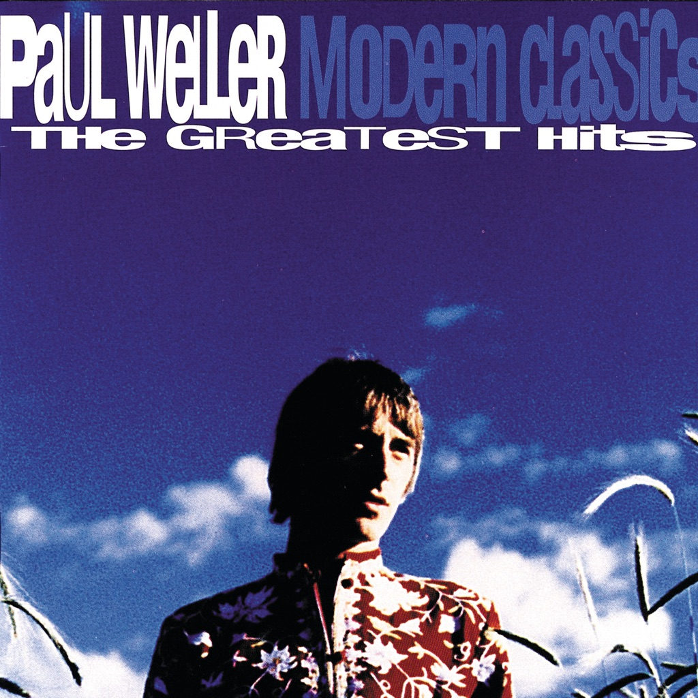

<!-- section break -->

1. Out Of The Sinking
2. Peacock Suit
3. Sunflower
4. The Weaver
5. Wild Wood
6. Above The Clouds
7. Uh-Huh Oh-Yeh
8. Brushed
9. The Changingman
10. Friday Street
11. You Do Something To Me
12. Brand New Start
13. Hung Up
14. Mermaids
15. Broken Stones
16. Into Tomorrow
17. Bonus Tracks: Live Classics
18. Into Tomorrow
19. Peacock Suit
20. Friday Street
21. Mermaids
22. Out Of The Sinking
23. Heavy Soul
24. Wild Wood
25. Up In Suze's Room
26. (Can You Heal Us) Holy Man?
27. Changing Man
28. Porcelain Gods
29. Sunflower
30. Broken Stones

<!-- section break -->

## Spotify


## Videos
### Peacock Suit
 

### More Videos

- [Mermaids](https://www.youtube.com/watch?v=xds2QRD4078)
- [The Changingman (Single Edit)](https://www.youtube.com/watch?v=njO6MuSlY9o)
- [Brand New Start](https://www.youtube.com/watch?v=eAZGKO0VQKw)

## Release Information
|  Key           | Value                                                |
| ---------------| ---------------------------------------------------- |
| Release Year   | 2022                                   |
| Discogs Link   | [Paul Weller - Modern Classics (The Greatest Hits)](https://www.discogs.com/release/24798500-Paul-Weller-Modern-Classics-The-Greatest-Hits) |
| Label          | Island Records |
| Format         | Vinyl 2× LP Compilation Reissue (Gatefold) |
| Catalog Number | 357 934-1 |
| Notes | Gatefold sleeve includes Bonus Live LP and insert.  Tracks on LP 1 numbered sequentially regardeless of sides.  All tracks published by BMG Music Publishing Ltd. / Stylist Music Ltd. except A8 "Brushed" also published by Notting Hill Music Ltd. / MCA Music Ltd.  Tracks A1 & B11 recorded at The Manor Studios, Oxford, Aug. '94. Track A2 recorded at Rockfield Studios, Wales, May '96. Tracks A3 to A5 recorded at The Manor Studios, Oxford, April / May '93. Tracks A6 & B16 recorded at Solid Bond Studios, London, Feb. '91. Track A7 recorded at Comforts Place, East Grinstead, Sept. '91. Tracks A8 & B10 recorded at The Wool Hall Studios, Bath, Feb. / March '97. Tracks B9 & B15 recorded at The Manor Studios, Oxford, Jan. '95. Track B12 recorded at Studio Two, Abbey Road, London, April '98. Track B13 recorded at The Manor Studios, Oxford, Feb. '94. Track B14 recorded at The Gallery Studios, Chertsey, Sept. '96.  Tracks C1 to D6 recorded live at Victoria Park, Hackney, London, 8/8/98.  Tracks A6, A7 & B16 ℗ 1992 Go! Discs Ltd.  Tracks A3 to A5 ℗ 1993 Go! Discs Ltd.  Tracks A1 & B13 ℗ 1994 Go! Discs Ltd.  Tracks B9, B11 & B15 ℗ 1995 Go! Discs Ltd.  Track A2 ℗ 1996 Go! Discs Ltd.  Tracks A8, B10 & B14 ℗ 1997 Go! Discs Ltd.  Track B12 ℗ 1998 Go! Discs Ltd.  Title on spine is simply 'Modern Classics'  Made in the Netherlands (on sticker on rear) Made in the EU (on sleeve) |