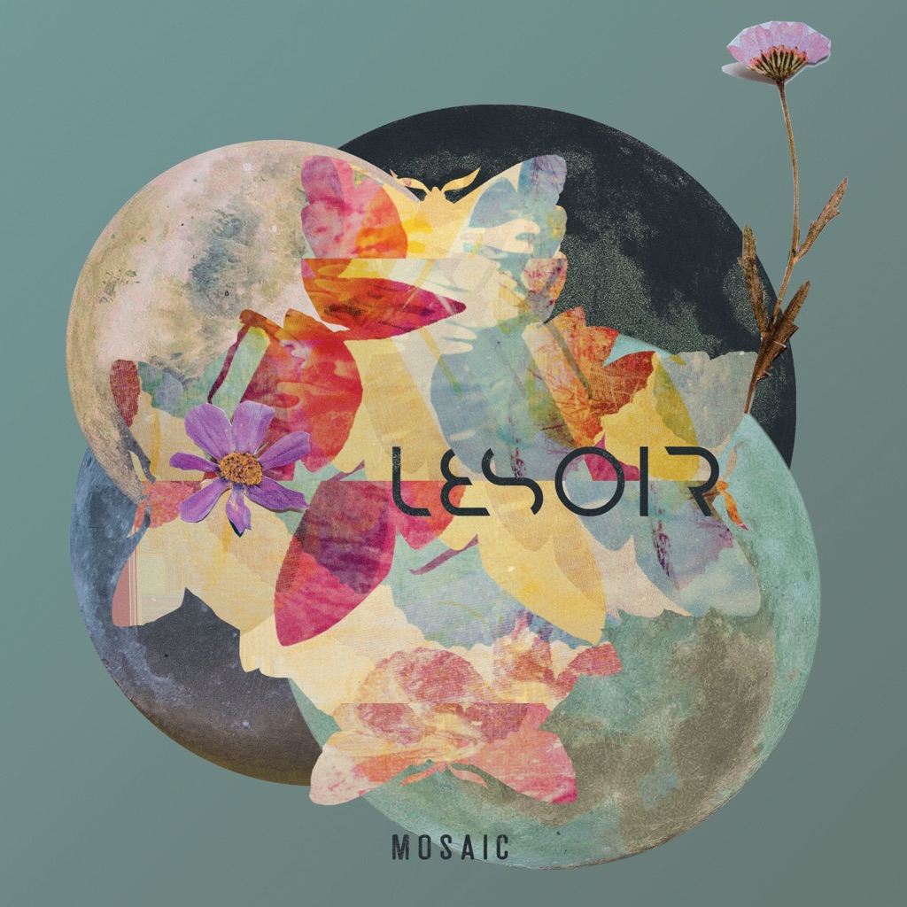

<!-- section break -->

1. Mosaic
2. Is This It?
3. Somebody Like You
4. The Geese
5. Measure Of Things
6. Dystopia
7. It's Never Quiet
8. MXI
9. Two Faces

<!-- section break -->

## Spotify


## Videos
### Measure Of Things
 

### More Videos

- [Mosaic](https://www.youtube.com/watch?v=cZSZcsb1hWI)
- [Dystopia](https://www.youtube.com/watch?v=Re6zf28IqtE)
- [Two Faces](https://www.youtube.com/watch?v=_RMjT1nJjXQ)
- [Is This It](https://www.youtube.com/watch?v=yj1qIe_u9jY)
- [Lesoir - Mosaic](https://www.youtube.com/watch?v=ohbUY6f2csY)
- [It's Never Quiet](https://www.youtube.com/watch?v=vNVwJg3loXc)

## Release Information
|  Key           | Value                                                |
| ---------------| ---------------------------------------------------- |
| Release Year   | 2020                                   |
| Discogs Link   | [Lesoir - Mosaic](https://www.discogs.com/release/15250776-Lesoir-Mosaic) |
| Label          | GlassVille Records |
| Format         | Vinyl LP Album Stereo |
| Catalog Number | GVR192755 |
| Notes | Packaged in a single jacket with color printed LP sleeve.  Pre-orders via the band came autographed on the back of the jacket by all members.  All tracks were recorded at Airfield Studios, St Merryn, Cornwall, United Kingdom except A3 recorded at MC Pavarotti, Mostar BA & Muziekgieterij, Maastricht, Netherlands.  Tracks are numbered continuously on the color LP sleeve. |