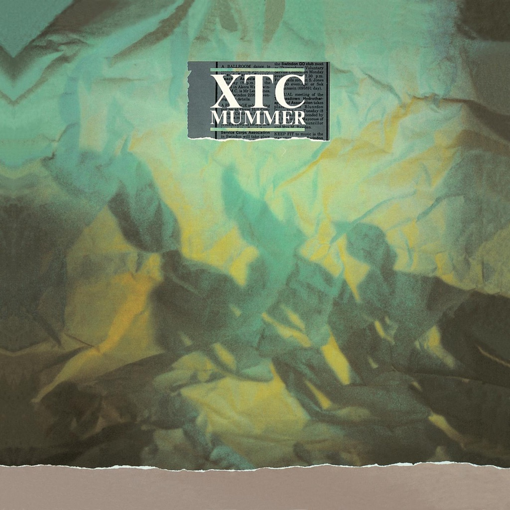

<!-- section break -->

1. Beating Of Hearts (3:58)
2. Wonderland (4:47)
3. Love On A Farmboy's Wages (3:58)
4. Great Fire (3:47)
5. Deliver Us From The Elements (4:35)
6. Human Alchemy (5:10)
7. Ladybird (4:32)
8. In Loving Memory Of A Name (3:15)
9. Me And The Wind (4:17)
10. Funk Pop A Roll (3:03)

<!-- section break -->

## Spotify


## Videos
### XTC - Beating of Hearts
 

### More Videos

- [XTC   In Loving Memory of a Name](https://www.youtube.com/watch?v=GTLVRD8S-3s)
- [XTC - Beating of Hearts](https://www.youtube.com/watch?v=MT4zz2b50kg)
- [XTC - Wonderland](https://www.youtube.com/watch?v=7DCtdVdvuE0)
- [XTC - Love on a Farmboy's Wages](https://www.youtube.com/watch?v=4VSFU0jKVYs)
- [XTC - Funk Pop A Roll](https://www.youtube.com/watch?v=JnvO6lrZSxo)

## Release Information
|  Key           | Value                                                |
| ---------------| ---------------------------------------------------- |
| Release Year   | 2022                                   |
| Discogs Link   | [XTC - Mummer](https://www.discogs.com/release/23134673-XTC-Mummer) |
| Label          | Ape House |
| Format         | Vinyl LP Album Reissue (200g) |
| Catalog Number | APELP106 |
| Notes | The album has been mastered with input from Andy Partridge.  Sticker:  'Ultra High-Quality Vinyl - VF - Made In England'     |