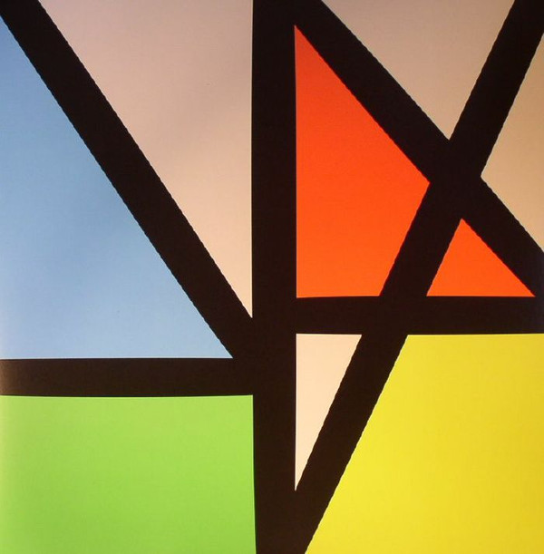

<!-- section break -->

1. Restless (5:26)
2. Singularity (5:37)
3. Plastic (6:58)
4. Tutti Frutti (6:22)
5. People On The High Line (5:41)
6. Stray Dog (6:14)
7. Academic (5:54)
8. Nothing But A Fool (7:42)
9. Unlearn This Hatred (4:18)
10. The Game (5:06)
11. Superheated (5:03)

<!-- section break -->

## Spotify


## Videos
### New Order - Singularity (Official Music Video)
 

## Release Information
|  Key           | Value                                                |
| ---------------| ---------------------------------------------------- |
| Release Year   | 2015                                   |
| Discogs Link   | [New Order - Music Complete](https://www.discogs.com/release/7510121-New-Order-Music-Complete) |
| Label          | Mute |
| Format         | Vinyl 2× LP Album |
| Catalog Number | STUMM390 |
| Notes | This is the non-limited black vinyl edition which includes a 12 page booklet featuring variations of the 'lines' artwork in black & white and recording credits. A code to redeem a digital copy of the album in both 96khz/24-bit FLAC and 320kbps MP3 formats from the Mute web site is also included on a sticker on the inner vinyl bag. Issued in a Gatefold sleeve as all other versions. Additional notes from the booklet state:  · Managed by Rebecca Boulton and Andrew Robinson at Prime Management. · New Order published by Universal Music Publishing, · Tom Rowlands published by BMG Rights Management (UK) Ltd., · Brandon Flowers published by Universal-Polygram International Publishing Inc. (ASCAP). · Richard X appears courtesy of blackmelody.com · Pete Hofmann appears courtesy of gothamproducers.com · Iggy Pop appears courtesy of Thousand Mile Inc. · Strings recorded at 80 Hertz Studios, The Sharp Project, Manchester.  ℗&© 2015 New Order Ltd. under exclusive license to Mute Artists Ltd. Printed in the EU. |