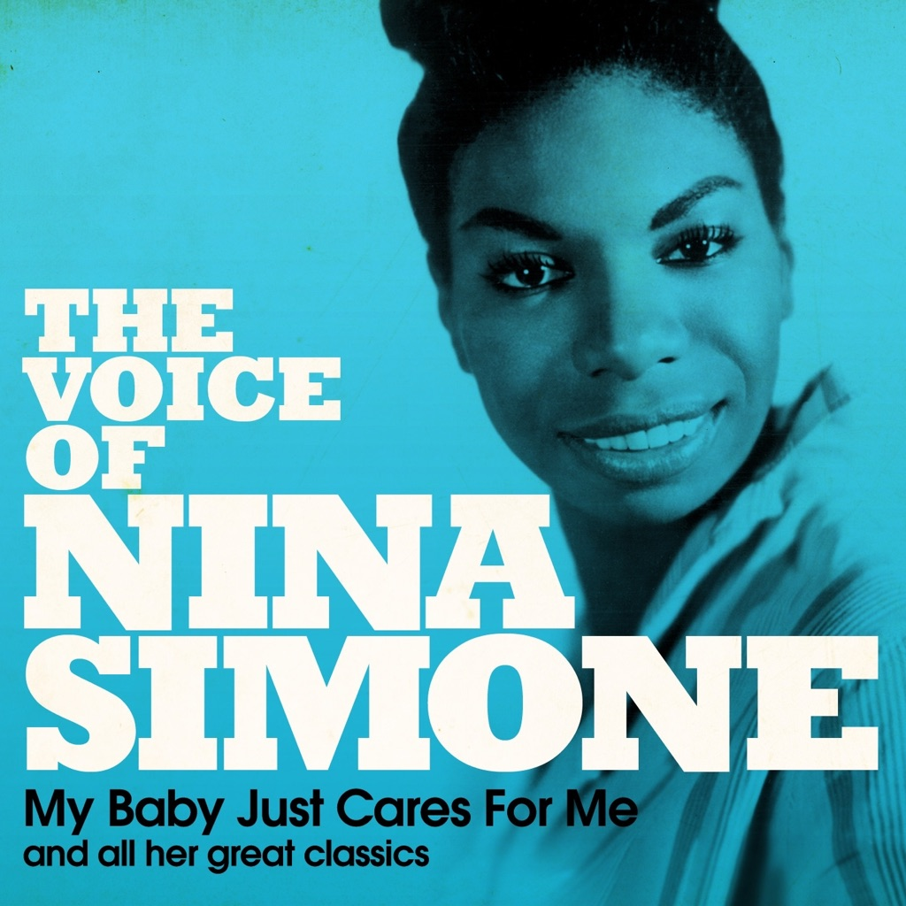

<!-- section break -->

1. My Baby Just Cares For Me (3:42)
2. Mood Indigo (4:09)
3. Don't Smoke In Bed (3:16)
4. Little Girl Blue (4:24)
5. You'll Never Walk Alone (3:52)
6. Central Park Blues (6:56)
7. He Needs Me (2:34)
8. Good Bait (5:33)
9. Plain Gold Ring (3:59)
10. I Loves You Porgy (4:15)
11. The Other Woman (3:01)
12. Cotton Eyed Joe (2:52)
13. Work Song (2:37)
14. Forbidden Fruit (3:50)
15. He's Got The Whole World In His Hands (3:09)
16. Love Me Or Leave Me (3:25)
17. Exactly Like You (3:16)
18. Black Is The Colour Of My True Love's Hair (3:35)
19. Children Go Where I Send You (2:55)
20. Summertime (5:36)

<!-- section break -->

## Spotify


## Release Information
|  Key           | Value                                                |
| ---------------| ---------------------------------------------------- |
| Release Year   | 2012                                   |
| Discogs Link   | [Nina Simone - My Baby Just Cares For Me](https://www.discogs.com/release/3895928-Nina-Simone-My-Baby-Just-Cares-For-Me) |
| Label          | Not Now Music |
| Format         | Vinyl 2× LP Compilation |
| Catalog Number | NOT2LP156 |
| Notes | The compilation was recorded between 1957 and 1961.   "Special 2LP Gatefold Edition 20 Original Recordings From The Legendary Jazz & Blues Great On 180g Vinyl".  ℗ & © 2012 Not Now Music Limited  Made in the E.U. |