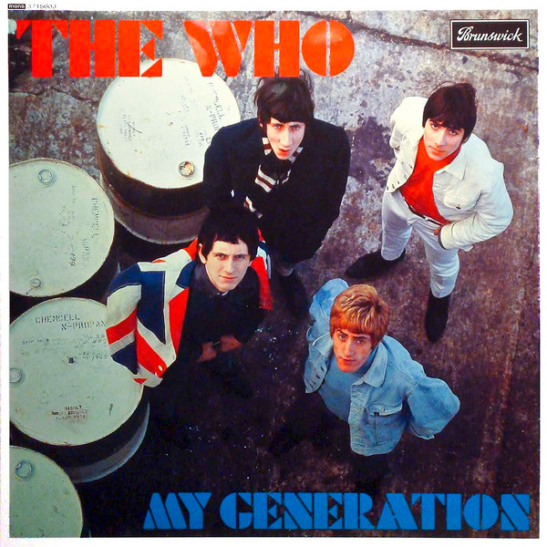

<!-- section break -->

1. Out In The Street
2. I Don't Mind
3. The Good's Gone
4. La-La-La-Lies
5. Much Too Much
6. My Generation
7. The Kids Are Alright
8. Please, Please, Please
9. It's Not True
10. I'm A Man
11. A Legal Matter
12. The Ox

<!-- section break -->

## Spotify


## Release Information
|  Key           | Value                                                |
| ---------------| ---------------------------------------------------- |
| Release Year   | 2015                                   |
| Discogs Link   | [The Who - My Generation](https://www.discogs.com/release/4285170-The-Who-My-Generation) |
| Label          | Brunswick |
| Format         | Vinyl LP Album Reissue Repress Mono |
| Catalog Number | 3715603 |
| Notes | Standalone repress of the 2012 cut originally used for [r=4043005] box.  Released on 180g vinyl (not mentioned on the release).   Cut at Metropolis (M logo in runouts).    Copies with ABBEY ROAD in runouts belong to [r=23421197].  Runouts are stamped except for the M logo and Miles name which are etched.  [On back cover:]  ℗ 1965 Polydor Ltd. (UK). © 1965 Polydor Ltd. (UK). A Universal Music Company. [...] Made in the EU.  [On labels:] [...] Long Playing Microgroove Record Made in England. Brunswick Ltd. London. |