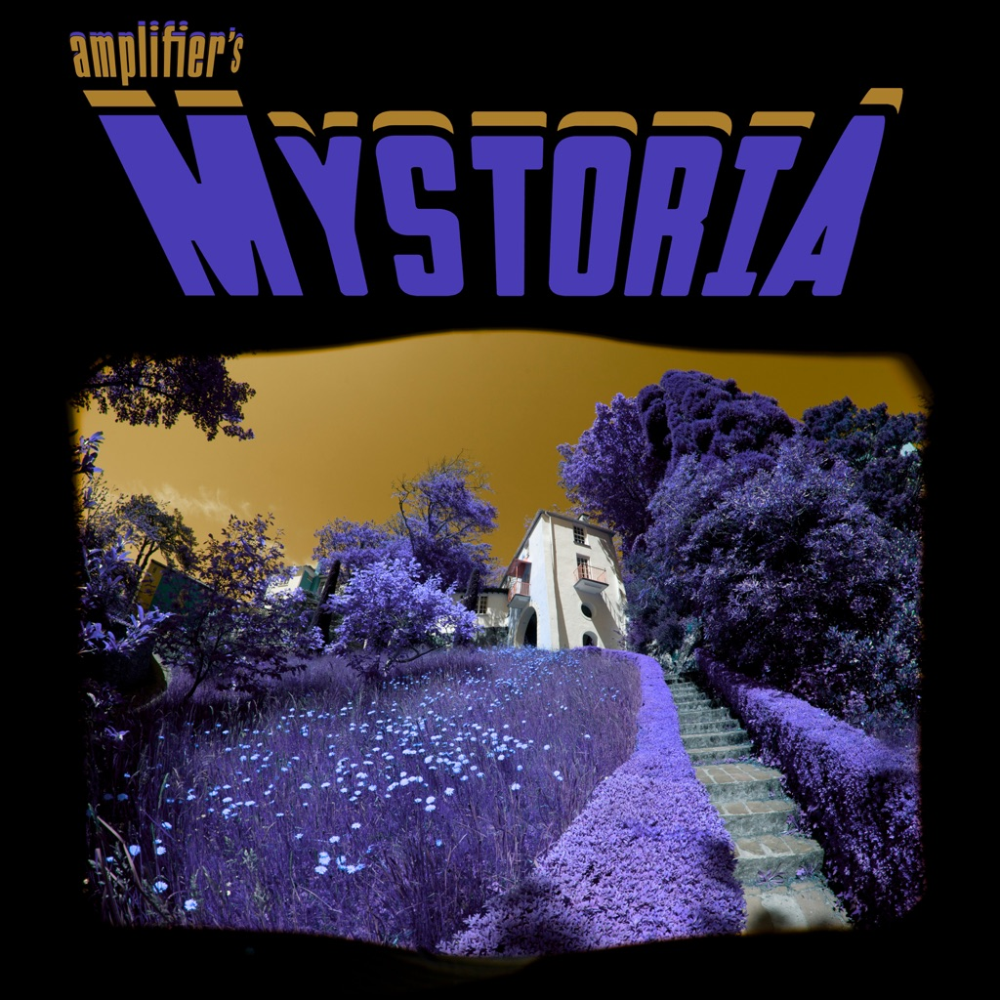

<!-- section break -->

1. Magic Carpet
2. Black Rainbow
3. Named After Rocky
4. Cat's Cradle
5. Bride
6. Open Up
7. OMG
8. The Meaning Of If
9. Crystal Mountain
10. Crystal Anthem
11. Magic Carpet
12. Black Rainbow
13. Named After Rocky
14. Cat's Cradle
15. Bride
16. Open Up
17. OMG
18. The Meaning Of If
19. Crystal Mountain
20. Crystal Anthem

<!-- section break -->

## Videos
### AMPLIFIER - Open Up (LYRIC VIDEO)
 

### More Videos

- [AMPLIFIER - Black Rainbow (OFFICIAL VIDEO)](https://www.youtube.com/watch?v=U6aB4735tvQ)
- [AMPLIFIER - ChugChugChugChug (Studio Episode #1)](https://www.youtube.com/watch?v=2IBQEao8Qhk)
- [AMPLIFIER - Named After Rocky (OFFICIAL VIDEO)](https://www.youtube.com/watch?v=RblO4B6h2tc)
- [Amplifier - Black Rainbow](https://www.youtube.com/watch?v=z3JBcuP1FfQ)

## Release Information
|  Key           | Value                                                |
| ---------------| ---------------------------------------------------- |
| Release Year   | 2014                                   |
| Discogs Link   | [Amplifier - Mystoria](https://www.discogs.com/release/6055632-Amplifier-Mystoria) |
| Label          | Superball Music |
| Format         | Vinyl LP Album, CD Album |
| Catalog Number | SBMLP 032 |
| Notes | 180 gram black vinyl in gatefold cover with printed innersleeves  Comes with cd version of the album |