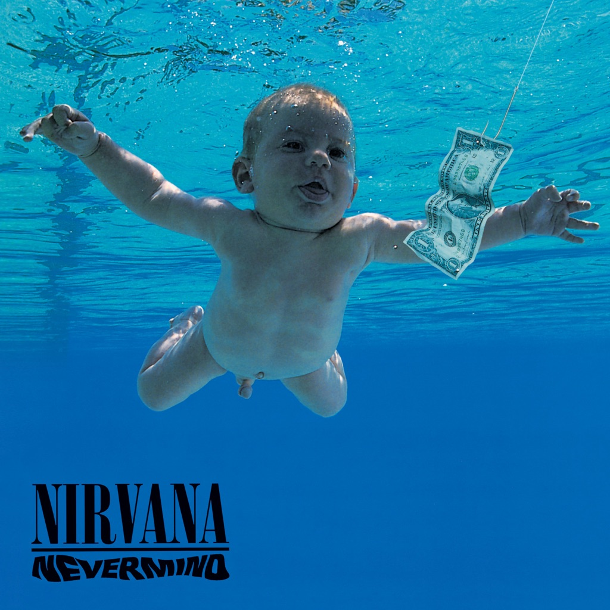

<!-- section break -->

1. Smells Like Teen Spirit (5:01)
2. In Bloom (4:14)
3. Come As You Are (3:39)
4. Breed (3:03)
5. Lithium (4:17)
6. Polly (2:57)
7. Territorial Pissings (2:23)
8. Drain You (3:43)
9. Lounge Act (2:36)
10. Stay Away (3:32)
11. On A Plain (3:16)
12. Something In The Way (3:51)
13. Endless, Nameless (6:38)
14. Even In His Youth (3:00)
15. Aneurysm (4:43)

<!-- section break -->

## Spotify


## Videos
### Nirvana - Come As You Are (Official Music Video)
 

### More Videos

- [Выпуск №66. Nirvana ‎– Nevermind(Vinyl, LP, Album, Reissue, 180g)](https://www.youtube.com/watch?v=L1lTdnFQZw4)
- [Nirvana - Smells Like Teen Spirit (Official Music Video)](https://www.youtube.com/watch?v=hTWKbfoikeg)
- [Nirvana - In Bloom (Official Music Video)](https://www.youtube.com/watch?v=PbgKEjNBHqM)
- [Nirvana - Breed (Audio)](https://www.youtube.com/watch?v=J6EDW5WFb2M)
- [Nirvana - Lithium (Official Music Video)](https://www.youtube.com/watch?v=pkcJEvMcnEg)
- [Nirvana - Polly (Audio)](https://www.youtube.com/watch?v=DrlaVYKWeLU)
- [Nirvana - Territorial Pissings (Audio)](https://www.youtube.com/watch?v=9yNPgx0swCM)
- [Nirvana - Drain You (Audio)](https://www.youtube.com/watch?v=AJUpHxlJUNQ)
- [Nirvana - Lounge Act (Audio)](https://www.youtube.com/watch?v=dZqpol8Yrq8)
- [Nirvana - Stay Away (Audio)](https://www.youtube.com/watch?v=vnHm-u4IYuo)
- [Nirvana - On A Plain (Audio)](https://www.youtube.com/watch?v=c023U4oQGr4)
- [Nirvana - Something In The Way (Audio)](https://www.youtube.com/watch?v=4VxdufqB9zg)
- [Nirvana - Endless, Nameless (Audio)](https://www.youtube.com/watch?v=uj1PagCfejs)
- [Even In His Youth (B-Side)](https://www.youtube.com/watch?v=plBMcpRRrVw)
- [Nirvana - Aneurysm](https://www.youtube.com/watch?v=y7TPnH5emFg)

## Release Information
|  Key           | Value                                                |
| ---------------| ---------------------------------------------------- |
| Release Year   | 2021                                   |
| Discogs Link   | [Nirvana - Nevermind](https://www.discogs.com/release/20914213-Nirvana-Nevermind) |
| Label          | Geffen Records |
| Format         | Vinyl LP Album Reissue Remastered (180 gram), Vinyl 7" 45 RPM, All Media Limited Edition (30th Anniversary Edition, Gatefold) |
| Catalog Number | 3846123 |
| Notes | On yellow/black hype sticker: Nirvana 30th Anniversary Edition Nevermind Limited Edition 180-Gram Premium Gatefold Jacket + 7-Inch Newly Remastered  On back cover: David Geffen Company Produced by special arrangement with Sub Pop Records. A Geffen Records reissue. 2021 UMG Recordings, Inc. Distributed by Universal Music Enterprises a Division of UMG Recordings Inc. Geffen Records, 2220 Colorado Avenue, Santa Monica, CA 90404. All rights reserved. Made in Czech Republic 3846123  Commemorating the 30th anniversary of Nirvana’s seminal 1991 release, Nevermind has been newly remastered from the original analog tapes on 180-gram vinyl. The 1LP version has been expanded to a premium tip-on gatefold jacket for the first time and includes a brand new 7-inch vinyl ("Endless, Nameless" with B-sides "Even In His Youth" and "Aneurysm").  Glossy gatefold jacket with black polylined & paper inner sleeve. Black/white insert. 7-inch in separate jacket with transparent inner sleeve. Barcode is on sticker only.  Runout details: everything is stamped except "B0034257-XX-X XX" and "RKS", which is etched. |