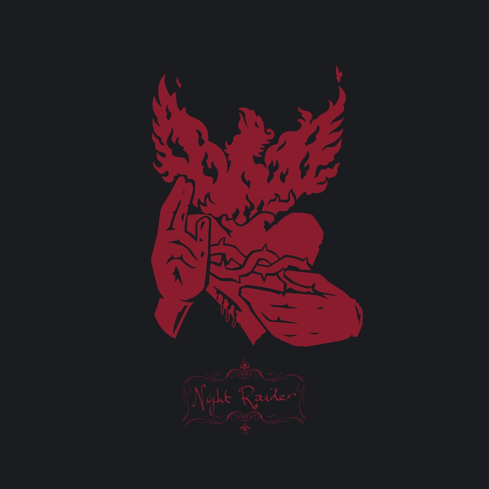

<!-- section break -->

1. Time Of Ye Life
2. Born For Nothing
3. Paranoid Arm Of Narcoleptic Empire
4. Wendigo
5. Bat Stack
6. Along Where The Wind Blows
7. Onward Ever Downwards
8. A Lack Of Common Sense
9. Trust No One
10. I Am Free, Today I Perished

<!-- section break -->

## Spotify


## Videos
### Time of Ye Life / Born for Nothing / Paranoid Arm of Narcoleptic Empire (Remastered)
 

## Release Information
|  Key           | Value                                                |
| ---------------| ---------------------------------------------------- |
| Release Year   | 2019                                   |
| Discogs Link   | [Crippled Black Phoenix - Night Raider](https://www.discogs.com/release/13562794-Crippled-Black-Phoenix-Night-Raider) |
| Label          | Kscope |
| Format         | Vinyl 2× LP Reissue Remastered Album |
| Catalog Number | KSCOPE1031 |
| Notes | Both LPs in one single non-glossy cardboard sleeve, each in black inner sleeve (paper with antistatic foil). No durations listed on release.  On labels: ℗ 2011 Crippled Black Phoenix © 2019 Crippled Black Phoenix  On sleeve back: ℗ 2011 Crippled Black Phoenix © 2019 Snapper Music Ltd. The copyright in this sound recording is owned by Snapper Music Ltd. Kscope is a Snapper Music label.  |