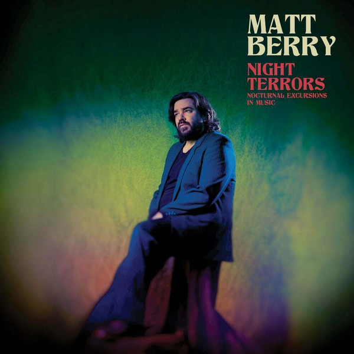

<!-- section break -->

1. Night Terrors (Saint Etienne Remix) (4:15)
2. Middle Of The East (3:39)
3. Angi (2:48)
4. Lord Above (Matt Berry Meets Thomas Walsh) (3:30)
5. Any Colour You Like (3:25)
6. Mr Green Genes (2:58)
7. Hey Little Girl (3:48)
8. Night Terrors (Clark Remix) (6:28)

<!-- section break -->

## Videos
### Angi
 

### More Videos

- [Matt Berry - The Night Terrors (Saint Etienne Remix)](https://www.youtube.com/watch?v=m32LRNhhNXQ)
- [Middle Of The East](https://www.youtube.com/watch?v=GwW94fHiSe4)
- [MATT BERRY-Lord above (Matt Berry meets Thomas Walsh)](https://www.youtube.com/watch?v=W3SFPuZlPZY)
- [Any Colour You Like](https://www.youtube.com/watch?v=wL5B4TTwaLc)
- [Mr Green Genes](https://www.youtube.com/watch?v=QV6POsiCALs)
- [MATT BERRY-Hey little girl](https://www.youtube.com/watch?v=0W8Dl9qczsw)
- [Matt Berry - Night Terrors (Clark Remix)](https://www.youtube.com/watch?v=KVwpDYbf7Eo)

## Release Information
|  Key           | Value                                                |
| ---------------| ---------------------------------------------------- |
| Release Year   | 2017                                   |
| Discogs Link   | [Matt Berry - Night Terrors (Nocturnal Excursions In Music)](https://www.discogs.com/release/11157206-Matt-Berry-Night-Terrors-Nocturnal-Excursions-In-Music) |
| Label          | Acid Jazz |
| Format         | Vinyl LP Album Limited Edition Numbered |
| Catalog Number | AJXLP415 |
| Notes | Pre-orders from label website were signed. |